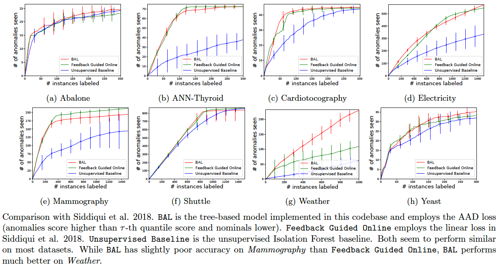

Comparison with related work
----------------------------
My former collaborators Siddiqui et al. have employed the same tree-based model we introduced in KDD IDEA workshop (Das et al. 2017), and compare a variety of loss functions. The linear loss (similar to the AAD loss) again performs the best on real data. This is no surprise. They start with the uniform weights and perform greedy-select-top query. The regularizer in their work does not let the weights vary a lot from previous iteration. This ensures that the top-scored instances lie in the region of uncertainty through most of the query budget, and therefore makes the greedy strategy label efficient. This offers further validation of our approach.

One misunderstanding about AAD (as stated in Siddiqui et al. 2018) is that AAD requires many parameters. **This is not correct.** The only configurable parameter is the approximate fraction of anomalies (tau). While earlier versions used to set separate penalty terms, these are all now set to 1.0 in AAD.

Siddiqui et al. is also limited to **linear** models. In contrast, since AAD tries to score anomalies higher than nominals in a principled manner with the tau-th ranked score/instance as proxy, it can be applied to introduce weak supervision to a variety of detectors including any parameterized density estimation based approach. If the model is differentiable, just wire it up in a framework like *Tensorflow* along with the AAD-style loss. In fact, our glocalized approach [GLAD](https://github.com/shubhomoydas/ad_examples#glocalized-anomaly-detection) (Das and Doppa 2018) does precisely this with a neural network in the mix.

**Note: The results for AAD in Siddiqui et al. were based on an older AAD codebase, hence not accurate. The below results were generated with the latest codebases for both algorithms.** These results were generated with commands in the file `python/compare_fbonline.txt`. The results for *KDDCup99* and *Covtype* could not be included for Siddiqui et al. because their code resulted in Segmentation Fault when run with 3000 feedback iterations (a reasonable budget for the large datasets).

**Reference(s)**:
  - Das, S., Wong, W-K., Fern, A., Dietterich, T. and Siddiqui, A. (2017). *Incorporating Feedback into Tree-based Anomaly Detection*, KDD Interactive Data Exploration and Analytics (IDEA) Workshop. [(pdf)](https://arxiv.org/pdf/1708.09441)
  - Siddiqui, A., Fern, A., Dietterich, T., et al. (2018). *Feedback-Guided Anomaly Discovery via Online Optimization*, KDD [(pdf)](http://web.engr.oregonstate.edu/~afern/papers/kdd18-siddiqui.pdf)
  - Das, S. and Doppa, J.R. (2018). *GLAD: GLocalized Anomaly Detection via Active Feature Space Suppression*. [(pdf)](https://arxiv.org/pdf/1810.01403.pdf)
  

