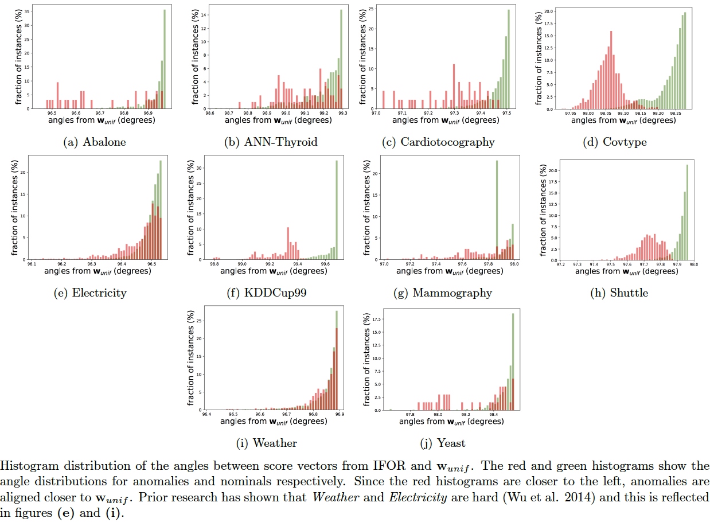

Motivation for ensemble-based active anomaly discovery
------------------------------------------------------
Anomaly/Outlier ensembles have not been understood very well and leading researchers in this field have called attention to this (Aggarwal 2012, Zimek et al. 2013). The research here tries to address this in a small way by considering the following questions:
  - Why does the average score across ensemble members perform best in most cases (Chiang et al. 2015) instead of other score combination strategies (e.g., min, max, median, etc.)?
  - Why does the greedy selection strategy for active learning almost always perform best?

This work is based on two basic assumptions (universal truths?) about anomaly detectors:
  1. They are **designed to assign the highest scores to true anomalies**.
  2. They **assign higher scores to anomalies than to nominals**.

These basic assumptions have enormous practical significance for active learning (Das et al. 2018) and are easily overlooked. Although they seem to imply the same thing (assumption 1 implies assumption 2), it helps to consider them separately because:
  - Assumption 1 tells us that for anomaly detection (esp. with ensembles), the region of label uncertainty is at a certain extreme location of the score-space.
  - Assumption 1 also implies that the average score is a good combination strategy *in the absence of any other information*
  - Assumption 2 helps us incorporate weak supervision.

**Reference(s)**:
  - Charu Aggarwal, Outlier Ensembles (Position Paper), KDD, 2012
  - Arthur Zimek, et al., Ensembles for Unsupervised Outlier Detection: Challenges and Research Questions, KDD 2013.
  - Alvin Chiang and Yi-Ren Yeh, Anomaly Detection Ensembles: In Defense of the Average,  2015 IEEE/WIC/ACM International Conference on Web Intelligence and Intelligent Agent Technology (WI-IAT)
  - Das, S., Islam, R., Jayakodi, N.K. and Doppa, J.R. (2018). *Active Anomaly Detection via Ensembles*. [(pdf)](https://arxiv.org/pdf/1809.06477.pdf)

Main idea behind active learning with ensembles
-----------------------------------------------
The main idea that helps understand AAD can be summarized as follows:
  - Uncertainty sampling for active learning in standard classification setting is label efficient
  - Anomaly detector ensembles, **by design**, enable uncertainty sampling for anomaly detection (this is **not** obvious) such that both learning the *margin* (in a linear model) as well as discovering anomalies is efficient:
    - For uncertainty sampling with a linear model, the hyperplane margin should pass through the region of uncertainty
    - The uncertainty region has a well-known prior when anomaly detector ensembles are employed
    - AAD designs a hyperplane that passes through the uncertainty region and tries to maintain it there so that uncertainty sampling can then be employed for anomaly detection
    - To ensure that the hyperplane passes through the region of uncertainty, a weak pair-wise constraint is employed; this constraint ensures that **labeled anomalies** are more likely to be assigned higher scores than **labeled nominals**; to make the constraint scalable, **AAD uses the score and instance ranked at the tau-th quantile as a proxy nominal**
    - Instances on one side of the margin are much more likely to be anomalies than on the other side; presenting instances from the 'anomaly' side to the analyst then reveals true anomalies faster

Challenges specific to active learning for anomaly detection
------------------------------------------------------------
While the basic approach and assumptions in active anomaly detection are simple (trivial?), there are three practical challenges that make this interesting:
  - **Accuracy:** The baseline unsupervised model in which we incorporate feedback should be state-of-the-art, else it defeats the whole enterprise.
  - **Feedback localization:** The label feedback should be localized to relevant regions of the feature space in order to improve generalization.
  - **Many labeled instances:** The model should be able to incorporate many labeled instances. An ensemble or a model with low *capacity* will always under-fit and result in many false positives later.

Keeping these challenges in mind, we consider two scenarios in i.i.d anomaly detection:
  - **Freedom to choose the ensemble model:** We can choose any state-of-the-art ensemble model for which the members can be generated cheaply such as tree-based (e.g., Isolation Forest), projection-based (e.g., LODA), feature-bagging, etc. Here, the general AAD framework applies easily
  - **Fixed few ensemble members:** In this case we can employ our glocalized anomaly detection technique (GLAD).

Desirable properties of ensembles
---------------------------------
The **desired properties** of an ensemble-based detector which will make it well-suited for active learning are:
  - **Inexpensive members:** computationally cheap to create ensemble members. If we employ a linear model (such as with AAD), it helps to have a large number of members because it then increases the capacity of the model to incorporate a large number of instance labels.
  - **Somewhat-OK (weak?) accuracy for individual members but high accuracy in aggregate:** if accuracy of each individual member is low, then more members will be desired
  - **Many and diverse members:** a large number of high-precision-low-recall members might work well in combination (such as the leaf nodes of tree-based detectors)

Some anomaly detectors which fit the above desiderata are:
  - LODA: The one-dimensional projections are the members
  - Tree-based detectors such as Isolation Forest: We may treat each tree in the forest or each node in the trees as the members
  - Feature bagging: Detectors created from each random feature subset act as the members

Applicability of the idea beyond ensembles
------------------------------------------
Any detector with tunable parameters can employ the AAD-type of weak supervision. Using the score and instance ranked at the tau-th quantile as a proxy nominal helps incorporate weak supervision when labels from only one class (anomaly or nominal) are available.

Intuition behind Active Anomaly Discovery
-----------------------------------------

*Question: Why should active learning help in anomaly detection with ensembles?* Let us assume that the anomaly scores are uniformly distributed on a 2D unit sphere as in the above figure (this is a setting commonly analysed in active learning theory literature as it is easier to convey the intuition). Also assume that **tau** fraction of instances are anomalous. When we treat the ensemble scores as 'features', then the 'feature' vectors of anomalies will tend to be closer to the uniform unit vector than the 'feature' vectors of nominals (uniform unit vector has the same values for all 'features' and magnitude = 1). This is because anomaly detectors are **designed** to assign higher scores to anomalies. In other words, the dot product between the score vectors of anomalies and the uniform vector is higher than the dot product between the scores vectors of nominals and the uniform vector. (Note: the dot product of any vector with the uniform vector is equivalent to the arithmetic mean of the vector components up to a multiplicative const.) This is why combining scores by averaging works well.

Seen another way, the hyperplane perpendicular to the uniform weight vector and offset by `cos(pi.tau)` (in this simple 2D setting only) should be a good prior for the separating hyperplane between the anomalies and the nominals so that, *ideally*, anomalies lie at the extreme end -- the top right side of the hyperplane. The *ideal* classification rule then is: `sign(w.x - cos(pi.tau))` such that +1 is anomaly, -1 is nominal. On real-world data however, the true hyperplane normal is not exactly same as the uniform vector, but should be close (else the anomaly detectors forming the ensemble are poor). AAD is basically trying to find this true hyperplane by solving a large-margin classification problem. The example `percept.percept` illustrates this where we have true anomaly distribution (red points in the plots) displaced by a slight angle (*theta*) from the uniform weights. The true hyperplane normal is represented by the blue dashed line.

With this setup, active learning can help discover the true anomaly region on the unit sphere (centered around blue dashed line) in a more efficient manner if we set the uniform vector (red dashed line) as a prior. To understand this intuitively, observe that we can design, as discussed in the previous paragraph, a hyperplane that is displaced from the origin such that a small fraction (*tau*) of instances are on one side and the rest are on the other side. Now, note three important observations: (1) top ranked instances are close to the hyperplane, (2) since instances close to the hyperplane have the most uncertain labels, top-ranked instances lie in the region of uncertainty (from the margin perspective), and (3) ensembles are designed so that most anomalies are top-ranked in the score-space which ensures that the uniform vector is a good prior for the hyperplane normal. Selecting top-ranked instances for labeling then results in **uncertainty** sampling which makes active learning *efficient* for learning the true hyperplane (see references below). It also makes selecting top-ranked instances for labeling efficient for discovering anomalies because: if the selected instance is truly an anomaly, it is a success; on the other hand, if the instance is a nominal, labeling it still helps to efficiently adjust the margin so that future query instances are more likely to be anomalies.

**Note on the tau-based hyperplane displacement:** The hyperplane displacement `cos(pi.tau)` is assumed only for the simple 2D scenario. In a real setting, we need to estimate the hyperplane displacement from the data, as is done by AAD. Most researchers will refer to this displacement as the *bias*.

**Note on score normalization:** By design (of ensemble members), the uniform weight vector is more closely 'hugged' by the ensemble score vectors of **true anomalies** than by the ensemble score vectors of nominals. However, if the score vectors are normalized to unit length (such that they all lie on a unit sphere), then this alignment is no longer guaranteed for every type of ensemble. For example, while the unit-length normalization works well for the Isolation Forest-based model with leaf nodes as the members, it does not work for the LODA-based model with the projection vectors as the members. The intuition behind AAD, as conveyed above, **does not** actually require the score vectors to lie on a unit sphere (not even for the Isolation Forest-based model). The general anomaly score distributions are expected to look more similar to the figure below when the anomaly scores are normalized to lie in the range [0, 1] -- as is commonly done before combining the member scores. The AAD intuition works well in this situation as well without any further unit-length normalization.

The distribution of the angles between the normalized score vectors and the uniform weight vector can be checked with `aad.test_hyperplane_angles`. As a recommendation: the IForest leaf-based scores may be normalized (though, not required), but LODA based scores should **not** be normalized to unit length. The following command will generate the angle distribution plot for a dataset (e.g. *Abalone*), as shown in (Das et al. 2018) under the folder `python/temp/angles`.

    bash ./aad.sh abalone 35 1 0.03 7 1 0 2 512 0 1 1

**Reference(s)**:
  - Das, S., Islam, R., Jayakodi, N.K. and Doppa, J.R. (2018). *Active Anomaly Detection via Ensembles*. [(pdf)](https://arxiv.org/pdf/1809.06477.pdf)
  - David Cohn, Les Atlas, and Richard Ladner. *Improving generalization with active learning.* Machine Learning, 15(2):201–221, May 1994.
  - Maria-Florina Balcan, Andrei Z. Broder, and Tong Zhang. *Margin based active learning.* In COLT, 2007.
  - Wu, K., Zhang, K., Fan, W., Edwards, A., and Philip, S. Y. *Rs-forest: A rapid density estimator for streaming anomaly detection.* In IEEE ICDM, 2014.

