Python libraries required:
--------------------------
    numpy (1.14.2)
    scipy (1.0.0)
    scikit-learn (0.19.1)
    cvxopt (1.1.9)
    pandas (0.22.0)
    ranking (0.3.1)
    statsmodels (0.9.0)
    matplotlib (2.1.0)
    tensorflow (1.6.0)

`python/requirements.txt` lists all these libraries. To install:

    pip install -r requirements.txt

Note: The code has been tested with **python 2.7**.


Anomaly Detection Examples
==========================
This is a collection of anomaly detection examples for detection methods popular in academic literature and in practice. I will include more examples as and when I find time.

Some techniques covered are listed below. These are a mere drop in the ocean of all anomaly detectors and are only meant to highlight some broad categories. Apologies if your favorite one is currently not included -- hopefully in time...
  - i.i.d setting:
    - [Standard unsupervised anomaly detectors](python/ad/ad_outlier.py) (Isolation Forest, LODA, One-class SVM, LOF)
    - [Clustering and density-based](python/ad/gmm_outlier.py)
    - [Density estimation based](python/ad/kde_outlier.py)
    - [PCA Reconstruction-based](python/ad/pca_reconstruct.py)
    - [Autoencoder Reconstruction-based](python/dnn/autoencoder.py)
    - [Classifier and pseudo-anomaly based](python/ad/pseudo_anom_outlier.py)
    - [Ensemble/Projection-based](python/loda/loda.py)
    - [A demonstration of outlier influence](python/ad/outlier_effect.py)
    - [Spectral-based](python/ad/spectral_outlier.py)
  - timeseries (**Jump to** [illustrations](#timeseries-anomaly-detection))
    - Forecasting-based
      - [Exploratory Analysis](#exploratory-analysis)
      - [ARIMA](#arima-forecasting)
      - [Regression](#regression-forecasting) (SVM, Random Forest, Neural Network)
      - [Recurrent Neural Networks](#timeseries-modeling-with-rnnslstms) (RNN/LSTM)
    - i.i.d
      - [Windows/Shingle based](#timeseries-outliers-with-shingles) (Isolation Forest, One-class SVM, LOF, Autoencoder)
  - [human-in-the-loop (active learning)](#active-anomaly-discovery-aad)
    - Active Anomaly Discovery ([batch setup](python/aad/aad_batch.py), [streaming setup](python/aad/aad_stream.py)) -- **Includes plots and illustrations (see sections below)**
      - [High-level summary of the approach](#active-anomaly-discovery-aad)
      - **Jump right in:** [General instructions on running AAD](#running-aad)
      - **Explanations and Interpretability:** [Generating anomaly descriptions with tree-based ensembles](#generating-compact-descriptions-with-aad)
      - **Query strategies:** [Diversifying query instances using the descriptions](#query-diversity-with-compact-descriptions) and its [evaluation](#does-query-diversity-with-compact-descriptions-help)
      - **Aside:** [When we have a lot of labeled data (both anomalies and nominals), should we employ a classifier instead of an anomaly detector?](#anomaly-detector-vs-classifier)
      - [Some properties of different tree-based detectors](#differences-between-isolation-forest-hs-trees-rs-forest)
      - [Running AAD with precomputed ensemble scores](#running-aad-with-precomputed-anomaly-scores)
      - **API Usage:** [How to employ AAD in your own application](#how-to-employ-aad-in-your-own-application)
      - [Data drift detection and model update with streaming data](#data-drift-detection)
      - **Aside:** [Applying drift detection to tree-based classifiers](#applying-drift-detection-to-tree-based-classifiers)
      - [A bit of theoretical intuition](#intuition-behind-active-anomaly-discovery)
  - [Reducing activity sequences to i.i.d](#activity-modeling) -- This illustrates an approach that is becoming increasingly popular as a starting-point for anomaly detection on activity sequences and transfer learning.


There are multiple datasets (synthetic/real) supported. Change the code to work with whichever dataset or algorithm is desired. Most of the demos will output pdf plots under the 'python/temp' folder when executed.

**AUC** is the most common metric used to report anomaly detection performance. See [here](python/dnn/autoencoder.py) for a complete example with standard datasets.

To execute the code:

1. **Run code from 'python' folder**. The outputs will be generated under 'temp' folder. The `pythonw` command is used on OSX, but `python` should be used on Linux.

2. To avoid import errors, make sure that `PYTHONPATH` is configured correctly to include the current dir: `.:/usr/local/lib/python`

3. *The run commands are at the top of the python source code files.*

4. Check the log file in `python/temp` folder. Usually it will be named <demo_code>.log. Timeseries demos will output logs under the `python/temp/timeseries` folder.


Active Anomaly Discovery (AAD)
==============================
This codebase replaces the older 'pyaad' project (https://github.com/shubhomoydas/pyaad). It implements an algorithm (AAD) to actively explore anomalies.

The main idea that helps understand AAD can be summarized as follows:
  - Uncertainty sampling for active learning in standard classification setting is label efficient
  - Anomaly detector ensembles, **by design**, enable uncertainty sampling for anomaly detection (this is **not** obvious) such that both learning the *margin* (in a linear model) as well as discovering anomalies is efficient:
    - For uncertainty sampling with a linear model, the hyperplane margin should pass through the region of uncertainty
    - The uncertainty region has a well-known prior when anomaly detector ensembles are employed
    - AAD designs a hyperplane that passes through the uncertainty region and tries to maintain it there so that uncertainty sampling can then be employed for anomaly detection
    - instances on one side of the margin are much more likely to be anomalies than on the other side; presenting instances from the 'anomaly' side to the analyst then reveals true anomalies faster

The **desired properties** of an ensemble-based detector which will make it well-suited for active learning are:
  - **Inexpensive members:** computationally cheap to create ensemble members. If we employ a linear model (such as with AAD), it helps to have a large number of members because it then increases the capacity of the model to incorporate a large number of instance labels.
  - **Somewhat-OK (weak?) accuracy:** if accuracy is low, then more members will be desired
  - **Many and diverse members:** a large number of high-precision-low-recall members might work well in combination (such as the leaf nodes of tree-based detectors)

Some anomaly detectors which fit the above desiderata are:
  - LODA: The one-dimensional projections are the members
  - Tree-based detectors such as Isolation Forest: We may treat each tree in the forest or each node in the trees as the members
  - Feature bagging: Detectors created from each random feature subset act as the members

The section ['Intuition behind Active Anomaly Discovery'](#intuition-behind-active-anomaly-discovery) below explains the idea in more depth.

**Assuming that the ensemble scores have already been computed**, the demo code [percept.py](https://github.com/shubhomoydas/ad_examples/blob/master/python/percept/percept.py) implements AAD in a much more simplified manner.

To run [percept.py](https://github.com/shubhomoydas/ad_examples/blob/master/python/percept/percept.py):

    pythonw -m percept.percept

The above command will generate a [pdf file](https://github.com/shubhomoydas/ad_examples/blob/master/documentation/percept_taurel_fixedtau_prior.pdf) with plots illustrating how the data was actively labeled.

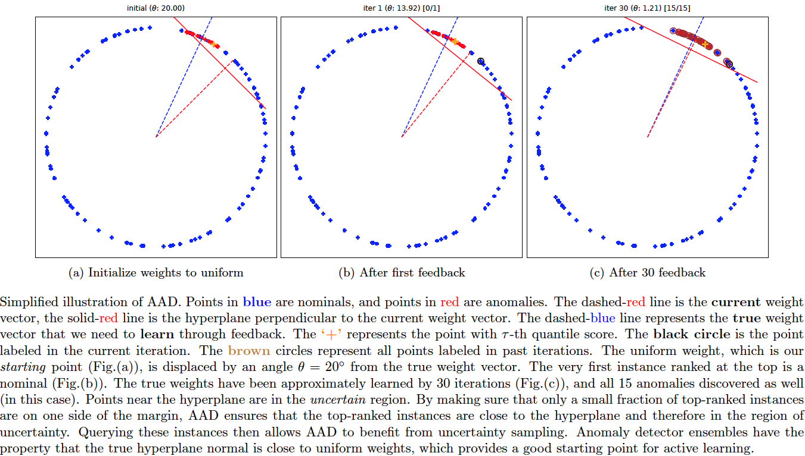


**Reference(s)**:
  - Das, S., Wong, W-K., Dietterich, T., Fern, A. and Emmott, A. (2016). *Incorporating Expert Feedback into Active Anomaly Discovery* in the Proceedings of the IEEE International Conference on Data Mining. [(pdf)](http://web.engr.oregonstate.edu/~wongwe/papers/pdf/ICDM2016.AAD.pdf)[(presentation)](https://github.com/shubhomoydas/aad/blob/master/overview/ICDM2016-AAD.pptx)

  - Das, S., Wong, W-K., Fern, A., Dietterich, T. and Siddiqui, A. (2017). *Incorporating Feedback into Tree-based Anomaly Detection*, KDD Interactive Data Exploration and Analytics (IDEA) Workshop. [(pdf)](https://arxiv.org/pdf/1708.09441)[(presentation)](https://github.com/shubhomoydas/pyaad/blob/master/presentations/IDEA17_slides.pptx)
  
  - Das, S. (2017). *Incorporating User Feedback into Machine Learning Systems*, [PhD Thesis](http://ir.library.oregonstate.edu/concern/graduate_thesis_or_dissertations/9019s7533) [(pdf)](https://ir.library.oregonstate.edu/downloads/m900p057t) -- Much of the work on AAD in this repository originated during my PhD research.


Running AAD
-----------
This codebase is my **research** platform. The main `bash` script `aad.sh` makes it easier to run all AAD experiments multiple times (in the spirit of scientific inquiry) so that final results can be averaged. I try to output results for different parameter settings into different folders (under `python/temp/aad`) so that results can be easily compared without conflicts. I also output to files the instance indexes (as 1-indexed and **not** 0-indexed) in the order they were queried for fine-grained analysis and visualization. If you want to introduce a new dataset with the least effort, then put its files under `datasets/anomaly` folder in the same format and structure as those of the `toy2` dataset and follow the same naming conventions. Else, a little effort would be needed to invoke the necessary data load APIs. You might also want to have a look at the [simplified API usage example](#how-to-employ-aad-in-your-own-application) (`python/aad/demo_aad.py`) below.

**Note:** It might seem that the script `aad.sh` requires an intimidating number of parameters, but bear in mind that the simplest settings (or automatic configuration from cross-validation etc.) are preferred for any formal publication. **The reason we allow so many parameters to be configurable is to support ablation studies and general curiosity.**

This codebase supports the following five different anomaly detection algorithms. If pre-computed anomaly scores are available from another ensemble-based algorithm, then jump to the [below section on pre-computed scores](#running-aad-with-precomputed-anomaly-scores).
  - The [LODA based AAD](python/aad/loda_aad.py) (**works with streaming data, but does not support incremental update to model after building the model with the first window of data**)
  - The [Isolation Forest based AAD](python/aad/random_split_trees.py) (**streaming support with model update**)
    - For streaming update, we support two modes:
      - **Mode 0**: Replace the oldest 20% trees (configurable) with new trees trained on the latest window of data. The previously learned weights of the nodes of the retained (80%) trees are retained, and the weights of nodes of new trees are set to a default value (see code) before normalizing the entire weight vector to unit length. For this mode, set `CHECK_KL_IND=0` in `aad.sh`.
      - **Mode 1** (Default): Replace trees based on KL-divergence. Further details are [below](#data-drift-detection). For this mode, set `CHECK_KL_IND=1` in `aad.sh`.
  - [HS Trees based AAD](python/aad/random_split_trees.py) (**streaming support with model update**)
    - For streaming update, the option `--tree_update_type=0` replaces the previous node-level sample counts with counts from the new window of data. This is as per the original published algorithm. The option `--tree_update_type=1` updates the node-level counts as a linear combination of previous and current counts -- this is an experimental feature.
  - [RS Forest based AAD](python/aad/random_split_trees.py) (**streaming support with model update**)
    - See the previous HS Trees streaming update options above.
  - The [Isolation Forest based AAD with Multiview](python/aad/multiview_forest.py) (**streaming support with model update**)
    - This is useful if (say) there are groups of features that represent coherent groups and we want to create trees only with the features in a particular group. For instance, in a malware detection application, we might have 100 features computed with static program features and 120 computed with dynamic program features. Then we want 50 isolation trees with only the 100 static features and 50 trees with the 120 dynamic features for a total of 100 trees. In a streaming situation, we would want the tree replacement to take into account the grouping as well, for example, if there has been no drift in the static features while there is a significant drift in dynamic features, we should not replace the trees of static features and only replace the trees of dynamic features.

To run the Isolation Forest / HS-Trees / RS-Forest / LODA based algorithms, the command has the following format (**remember to run the commands from the 'python' folder, and monitor progress in logs under 'python/temp' folder**):

    bash ./aad.sh <dataset> <budget> <reruns> <tau> <detector_type> <query_type[1|2|8|9]> <query_confident[0|1]> <streaming[0|1]> <streaming_window> <retention_type[0|1]> <with_prior[0|1]> <init_type[0|1|2]>

    for Isolation Forest, set <detector_type>=7; 
    for HSTrees, set <detector_type>=11;
    for RSForest, set <detector_type>=12;
    for LODA, set <detector_type>=13;
    for Isolation Forest Multiview, set <detector_type>=15;

Example (with Isolation Forest, non-streaming):

    bash ./aad.sh toy2 35 1 0.03 7 1 0 0 512 0 1 1

Note: The above will generate 2D plots (tree partitions and score contours) under the `temp` folder since *toy2* is a 2D dataset.

example (with HSTrees streaming):

    bash ./aad.sh toy2 35 1 0.03 11 1 0 1 256 0 1 1

**Note:** I **recommend using Isolation forest** instead of HSTrees and RSForest even if there is drift in data:

    bash ./aad.sh toy2 35 1 0.03 7 1 0 1 512 1 1 1


**Note on Streaming:**

Streaming currently supports two strategies for data retention:
  - Retention Type 0: Here the new instances from the stream completely overwrite the older *unlabeled instances* in memory.
  - Retention Type 1: Here the new instances are first merged with the older unlabeled instances and then the complete set is sorted in descending order on the distance from the margin. The top instances are retained; rest are discarded. **This is highly recommended.**


**Note on Query Strategies:**

See [below](#does-query-diversity-with-compact-descriptions-help) for query strategies currently supported. `QUERY_TYPE` variable in `aad.sh` determines the query strategy. One of the strategies discussed in detail below is to diversify queries using [descriptions](#query-diversity-with-compact-descriptions). This is invoked by `QUERY_TYPE=8` option. To actually see the benefits of this option, set the query batch size to greater than 1 (e.g., 3) (variable `N_BATCH` in `aad.sh`).


Generating compact descriptions with AAD
-------------------------------------------
AAD, when used with a forest-based detector such as Isolation Forest, can output a compact set of subspaces that contain all labeled anomalies. The idea is explained in [anomaly_description.pdf](https://github.com/shubhomoydas/ad_examples/blob/master/documentation/anomaly_description/anomaly_description.pdf). Following illustrations show the results of this approach.

**Note:** The algorithm to compute compact descriptions (as illustrated here) might also be considered to be a non-parametric clustering algorithm where each 'description' is a cluster.
  
To generate the below, use the command:
    
    bash ./aad.sh toy2 35 1 0.03 7 1 0 0 512 0 1 1

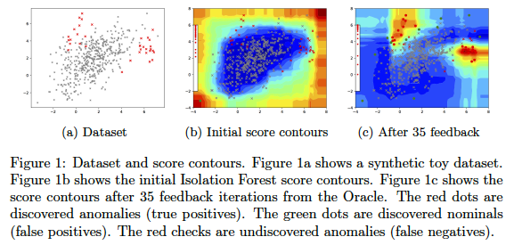

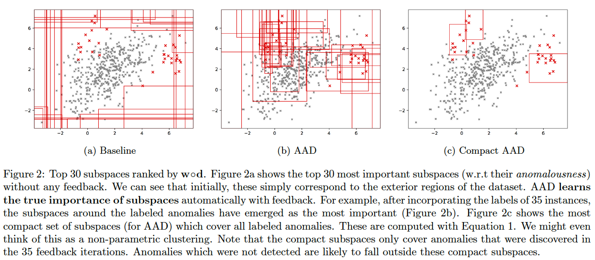


Applications of compact descriptions
------------------------------------
Compact descriptions have multiple uses including:
  - Discovery of diverse classes of anomalies very quickly by querying instances from different subspaces of the description
  - Improved interpretability and explainability of anomalous instances

We assume that in a practical setting, the analyst(s) will be presented with instances along with their corresponding description(s). Additional information can be derived from the descriptions and shown to the analyst such as the number of instances in each description, which can help prioritize the analysis. Unfortunately, most uses of descriptions are subjective or application dependent, and therefore, hard to evaluate. However, we can evaluate the improvement in query [diversity](#query-diversity-with-compact-descriptions) objectively as we do [below](#does-query-diversity-with-compact-descriptions-help).


Query diversity with compact descriptions
-----------------------------------------
The idea for querying a diverse set of instances without significantly affecting the anomaly detection efficiency is explained in [anomaly_description.pdf](https://github.com/shubhomoydas/ad_examples/blob/master/documentation/anomaly_description/anomaly_description.pdf).

To generate the below, use the command:
    
    bash ./aad.sh toy2 10 1 0.03 7 1 0 0 512 0 1 1

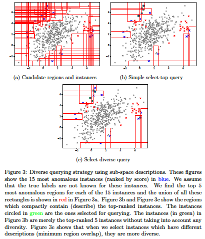


Does Query diversity with compact descriptions help?
----------------------------------------------------
We compare the following query strategies (variables `QUERY_TYPE, N_BATCH, N_EXPLORE` are set in `aad.sh`):
  - **Select the single-most anomalous instance per feedback iteration:** (`QUERY_TYPE=1, N_BATCH=1`) [Select](python/aad/query_model.py) the top-most instance ordered by anomaly score. (**BAL (Adaptive Prior)** in the plots below.)
  - **Select a set of the top-most anomalous instances per feedback iteration:** (`QUERY_TYPE=1, N_BATCH=3`) [Select](python/aad/query_model.py) a batch of three top-most instances ordered by anomaly score. (**ifor\_q1b3** in the plots below.)
  - **Select a random subset of the most anomalous instances per feedback iteration:** (`QUERY_TYPE=2, N_BATCH=3, N_EXPLORE=10`) [Select](python/aad/query_model.py) a random batch of three instances among top 10 anomalous instances. (**ifor\_top\_random** in the plots below.)
  - **Select a subset of most anomalous instances whose descriptions are diverse within a feedback iteration:** (`QUERY_TYPE=8, N_BATCH=3, N_EXPLORE=10`) [Select](python/aad/query_model_other.py) three instances among top 10 anomalous instances which have most diverse descriptions (explained in [previous section](#query-diversity-with-compact-descriptions)). (**BAL-D** in the plots below.)
  - **Select a subset of most anomalous instances which are farthest from each other within a feedback iteration:** (`QUERY_TYPE=9, N_BATCH=3, N_EXPLORE=10`) [Select](python/aad/query_model_euclidean.py) three instances among the top 10 anomalous instances which have the highest average euclidean distance between them. First short-list the top 10 anomalous instances as candidates. Now, to select a batch of (three) instances, first add the most anomalous instance from these candidates to the selected list. Then iterate (two more times); in each iteration, add that instance (from the candidates) to the selected list which has the maximum average distance from the instances currently in the selected list. This is a diversity strategy common in existing literature. (**BAL-E** in the plots below.)

The plots below show that the description-based diversity strategy `BAL-D` indeed helps. While selecting the top-most anomalous instances is [highly efficient](#intuition-behind-active-anomaly-discovery) for discovering anomalies, we can also improve the diversity in each query-batch through descriptions without loss in efficiency. Employing descriptions for diversity (`BAL-D`) also has similar query diversity on the *toy2* dataset as that which maximizes the euclidean distance (`BAL-E`); however, the description based strategy `BAL-D` has the advantage of being more user-friendly because it can characterize multiple anomalies through the descriptions.

To generate the below plots, perform the following steps (**remember to run the commands from the 'python' folder, and monitor progress in logs under 'python/temp' folder**):

    - set N_BATCH=1 in aad.sh and then run the command:
    
        bash ./aad.sh toy2 45 10 0.03 7 1 0 0 512 0 1 1
        
    - set N_BATCH=3 in aad.sh, and run the following commands:
    
        bash ./aad.sh toy2 45 10 0.03 7 1 0 0 512 0 1 1
        bash ./aad.sh toy2 45 10 0.03 7 2 0 0 512 0 1 1
        bash ./aad.sh toy2 45 10 0.03 7 8 0 0 512 0 1 1
        bash ./aad.sh toy2 45 10 0.03 7 9 0 0 512 0 1 1

    - Next, generate anomaly discovery curves:
        
        pythonw -m aad.plot_aad_results
        
    - Finally, generate class diversity plot:
    
        pythonw -m aad.plot_class_diversity

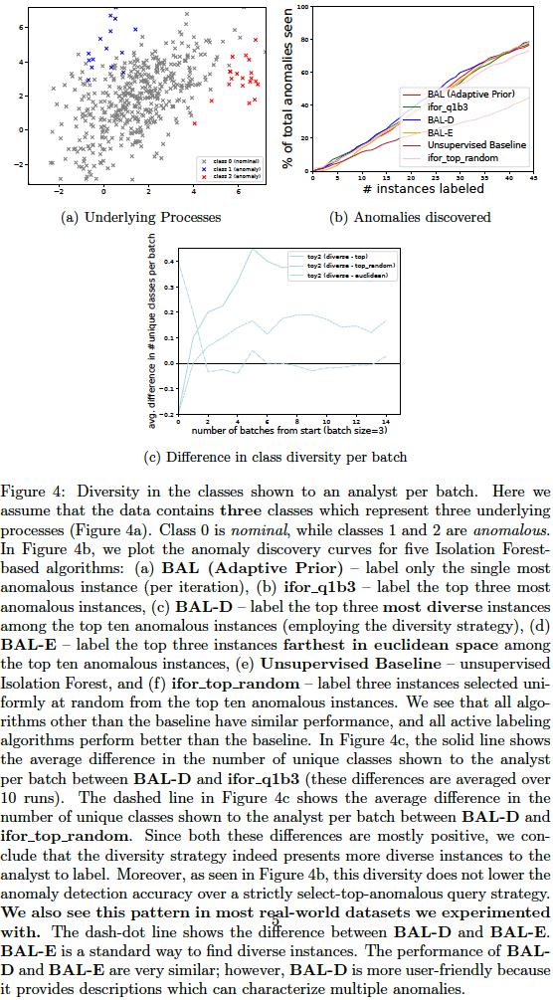


Anomaly Detector vs Classifier
------------------------------
A question that comes up often is: *if we have a lot of labeled anomaly and nominal instances, then could we employ a classifier instead of an anomaly detector?* The answer is: **it depends on the dataset and the application**. We illustrate the difference between the behavior of an anomaly detector (AAD) and a classifier (Random Forest) in the figure below. The compact description strategy of AAD is also applicable to tree-based classifiers (such as decision trees and random forests) as demonstrated in the plots. These figures were generated by the following command.

    pythonw -m aad.anomaly_vs_classifier --dataset=5 --algo=explain

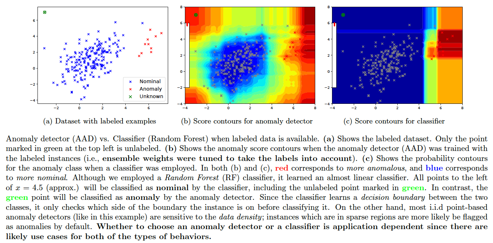


Differences between Isolation Forest, HS Trees, RS Forest
---------------------------------------------------------
This [document](https://github.com/shubhomoydas/ad_examples/blob/master/documentation/anomaly_description/anomaly_description.pdf) explains why Isolation Forest is more effective in incorporating feedback at the leaf level. This is illustrated in the figure below. The plots are generated in the files `query_candidate_regions_ntop5_*.pdf` and `query_compact_ntop5_*.pdf` under `temp/aad/toy2/*` when the following commands are executed:

    bash ./aad.sh toy2 35 1 0.03 7 1 0 0 512 0 1 1
    bash ./aad.sh toy2 35 1 0.03 11 1 0 0 512 0 1 1
    bash ./aad.sh toy2 35 1 0.03 12 1 0 0 512 0 1 1

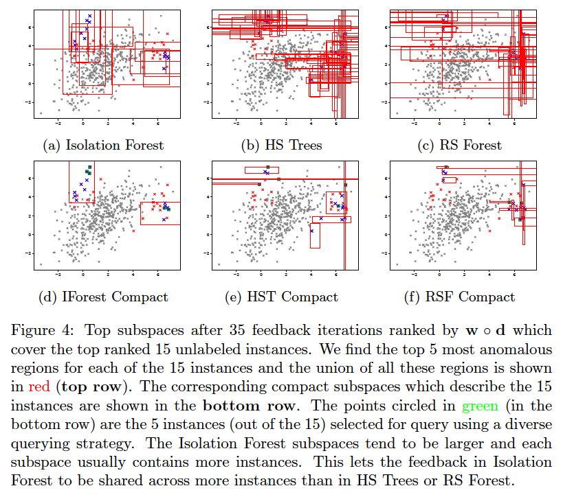


Running AAD with precomputed anomaly scores
-------------------------------------------
In case scores from anomaly detector ensembles are available in a CSV file, then AAD can be run with the following command.

    pythonw -m aad.precomputed_aad --startcol=2 --labelindex=1 --header --randseed=42 --dataset=toy --datafile=../datasets/toy.csv --scoresfile=../datasets/toy_scores.csv --querytype=1 --detector_type=14 --constrainttype=4 --sigma2=0.5 --budget=35 --tau=0.03 --Ca=1 --Cn=1 --Cx=1 --withprior --unifprior --init=1 --runtype=simple --log_file=./temp/precomputed_aad.log --debug

**Note: The detector_type is 14** for precomputed scores. The input file and scores should have the same format as in the example files (toy.csv, toy_scores.csv). Also, make sure the initialization is at uniform (`--init=1`) for good label efficiency (maximum reduction in false positives with minimum labeling effort). If the weights are initialized to zero or random, the results will be poor. *Ensembles enable us to get a good starting point for active learning in this case.*


How to employ AAD in your own application
-----------------------------------------
The below code (in [demo_aad.py](python/aad/demo_aad.py)) shows the simpest AAD implementation that can be used as a template by other developers. To load a different dataset, replace `get_synthetic_samples(stype=2)` (below) with the appropriate function(s). The following command executes the code; check the generated log file `python/temp/demo_aad.log` for details such as anomaly descriptions.

    pythonw -m aad.demo_aad


```python

from common.data_plotter import *
from common.gen_samples import *

from aad.aad_support import *
from aad.forest_description import *

"""
A simple no-frills demo of how to use AAD in an interactive loop.

To execute:
pythonw -m aad.demo_aad
"""

logger = logging.getLogger(__name__)


def get_debug_args(budget=30, detector_type=AAD_IFOREST):
    # return the AAD parameters what will be parsed later
    return ["--resultsdir=./temp", "--randseed=42",
            "--reruns=1",
            "--detector_type=%d" % detector_type,
            "--forest_score_type=%d" %
            (IFOR_SCORE_TYPE_NEG_PATH_LEN if detector_type == AAD_IFOREST
             else HST_LOG_SCORE_TYPE if detector_type == AAD_HSTREES
             else RSF_SCORE_TYPE if detector_type == AAD_RSFOREST else 0),
            "--init=%d" % INIT_UNIF,  # initial weights
            "--withprior", "--unifprior",  # use an (adaptive) uniform prior
            # ensure that scores of labeled anomalies are higher than tau-ranked instance,
            # while scores of nominals are lower
            "--constrainttype=%d" % AAD_CONSTRAINT_TAU_INSTANCE,
            "--querytype=%d" % QUERY_DETERMINISIC,  # query strategy
            "--num_query_batch=1",  # number of queries per iteration
            "--budget=%d" % budget,  # total number of queries
            "--tau=0.03",
            # normalize is NOT required in general.
            # Especially, NEVER normalize if detector_type is anything other than AAD_IFOREST
            # "--norm_unit",
            "--forest_n_trees=100", "--forest_n_samples=256",
            "--forest_max_depth=%d" % (100 if detector_type == AAD_IFOREST else 7),
            # leaf-only is preferable, else computationally and memory expensive
            "--forest_add_leaf_nodes_only",
            "--ensemble_score=%d" % ENSEMBLE_SCORE_LINEAR,
            "--resultsdir=./temp",
            "--log_file=./temp/demo_aad.log",
            "--debug"]


def describe_instances(x, instance_indexes, model, opts):
    """ Generates compact descriptions for the input instances

    :param x: np.ndarray
        The instance matrix with ALL instances
    :param instance_indexes: np.array(dtype=int)
        Indexes for the instances which need to be described
    :param model: Aad
        Trained Aad model
    :param opts: AadOpts
    :return: tuple, list(map)
        tuple: (region indexes, #instances among instance_indexes that fall in the region)
        list(map): list of region extents where each region extent is a
            map {feature index: feature range}
    """
    if not is_forest_detector(opts.detector_type):
        raise ValueError("Descriptions only supported by forest-based detectors")

    # get feature ranges which will be used to compute volumes
    feature_ranges = get_sample_feature_ranges(x)

    # get top region indexes which will be candidates for description
    reg_idxs = get_regions_for_description(x, instance_indexes=instance_indexes,
                                           model=model, n_top=opts.describe_n_top)

    # get volume of each candidate region
    volumes = get_region_volumes(model, reg_idxs, feature_ranges)

    # get the smallest set of smallest regions that together cover all instances
    selected_region_idxs = get_compact_regions(x, model=model,
                                               instance_indexes=instance_indexes,
                                               region_indexes=reg_idxs,
                                               volumes=volumes, p=opts.describe_volume_p)
    desc_regions = [model.all_regions[ridx].region for ridx in selected_region_idxs]
    _, memberships = get_region_memberships(x, model, instance_indexes, selected_region_idxs)
    instances_in_each_region = np.sum(memberships, axis=0)
    if len(instance_indexes) < np.sum(instances_in_each_region):
        logger.debug("\nNote: len instance_indexes (%d) < sum of instances_in_each_region (%d)\n"
                     "because some regions overlap and cover the same instance(s)." %
                     (len(instance_indexes), np.sum(instances_in_each_region)))
    return zip(selected_region_idxs, instances_in_each_region), desc_regions


def detect_anomalies_and_describe(x, y, opts):
    rng = np.random.RandomState(opts.randseed)

    # prepare the AAD model
    model = get_aad_model(x, opts, rng)
    model.fit(x)
    model.init_weights(init_type=opts.init)

    # get the transformed data which will be used for actual score computations
    x_transformed = model.transform_to_ensemble_features(x, dense=False, norm_unit=opts.norm_unit)

    # populate labels as some dummy value (-1) initially
    y_labeled = np.ones(x.shape[0], dtype=int) * -1

    # at this point, w is uniform weight. Compute the number of anomalies
    # discovered within the budget without incorporating any feedback
    baseline_scores = model.get_score(x_transformed, model.w)
    baseline_queried = np.argsort(-baseline_scores)
    baseline_found = np.cumsum(y[baseline_queried[np.arange(opts.budget)]])
    print("baseline found:\n%s" % (str(list(baseline_found))))

    qstate = Query.get_initial_query_state(opts.qtype, opts=opts, budget=opts.budget)
    queried = []  # labeled instances
    ha = []  # labeled anomaly instances
    hn = []  # labeled nominal instances
    while len(queried) < opts.budget:
        ordered_idxs, anom_score = model.order_by_score(x_transformed)
        qx = qstate.get_next_query(ordered_indexes=ordered_idxs,
                                   queried_items=queried)
        queried.extend(qx)
        for xi in qx:
            y_labeled[xi] = y[xi]  # populate the known labels
            if y[xi] == 1:
                ha.append(xi)
            else:
                hn.append(xi)

        # incorporate feedback and adjust ensemble weights
        model.update_weights(x_transformed, y_labeled, ha=ha, hn=hn, opts=opts, tau_score=opts.tau)

        # most query strategies (including QUERY_DETERMINISIC) do not have anything
        # in update_query_state(), but it might be good to call this just in case...
        qstate.update_query_state()

    # the number of anomalies discovered within the budget while incorporating feedback
    found = np.cumsum(y[queried])
    print("AAD found:\n%s" % (str(list(found))))

    # generate compact descriptions for the detected anomalies
    if len(ha) > 0:
        ridxs_counts, region_extents = describe_instances(x, np.array(ha), model=model, opts=opts)
        logger.debug("selected region indexes and corresponding instance counts (among %d):\n%s" %
                     (len(ha), str(list(ridxs_counts))))
        logger.debug("region_extents: these are of the form [{feature_index: (feature range), ...}, ...]\n%s" %
                     (str(region_extents)))


if __name__ == "__main__":

    # Prepare the aad arguments. It is easier to first create the parsed args and
    # then create the actual AadOpts from the args
    args = get_aad_command_args(debug=True, debug_args=get_debug_args())
    configure_logger(args)

    opts = AadOpts(args)
    logger.debug(opts.str_opts())

    np.random.seed(opts.randseed)

    # load synthetic (toy 2) dataset
    x, y = get_synthetic_samples(stype=2)

    # run interactive anomaly detection loop
    detect_anomalies_and_describe(x, y, opts)

```


Data Drift Detection
--------------------
This section applies to isolation tree-based detectors (such as [IForest](python/aad/random_split_trees.py) and [IForestMultiview](python/aad/multiview_forest.py)). Such trees provide a way to compute the KL-divergence between the data distribution of one [old] batch of data with another [new] batch. Once we determine which trees have the most significant KL-divergences w.r.t expected data distributions, we can replace them with new trees constructed from new data as follows:
  - First, randomly partition the current window of data into two equal parts (*A* and *B*).
  - For each tree in the forest, compute average KL-divergence as follows:
    - Treat the tree as set of histogram bins
    - Compute the instance distributions with each of the data partitions *A* and *B*.
    - Compute the KL-divergence between these two distributions.
    - Do this 10 times and average.
  - We now have *T* KL divergences where *T* is the number of trees.
  - Compute the (1-alpha) quantile value where alpha=0.05 by default, and call this *KL-q*.
  - Now compute the distributions for each isolation tree with the complete window of data -- call this *P* (*P* is a set of *T* distributions) -- and set it as the baseline.
  - When a new window of data arrives replace trees as follows:
    - Compute the distribution in each isolation tree with the *entire* window of new data and call this *Q* (*Q* is a set of *T* new distributions).
    - Next, check the KL-divergences between the distributions in P and the corresponding distributions in Q. If the KL-divergence i.e., *KL(p||q)* of at least (2\*alpha\*T) trees exceed *KL-q*, then:
      - Replace all trees whose *KL(p||q)* is higher than *KL-q* with new trees created with the new data.
      - Recompute *KL-q* and the baseline distributions *P* with the new data and the updated model.
      - Retrain the weights certain number of times (determined by `N_WEIGHT_UPDATES_AFTER_STREAM` in `aad.sh`, 10 works well) with just the labeled data available so far (no additional feedback). This step helps tune the ensemble weights better after significant change to the model.

For more details on KL-divergence based data drift detection, check the [demo code](python/aad/test_concept_drift.py). Execute this code with the following sample command and see the [plots](https://github.com/shubhomoydas/ad_examples/blob/master/documentation/concept_drift/concept_drift.pdf) generated (on the *Weather* dataset):
    
    pythonw -m aad.test_concept_drift --debug --plot --log_file=temp/test_concept_drift.log --dataset=weather

Following shows the results of integrating drift detection along with label feedback in a streaming/limited memory setting for the three datasets (*Covtype, Electricity, Weather*) which we determined have significant drift. We used `RETENTION_TYPE=1` in `aad.sh` for all datasets. The commands for generating the discovery curves for `SAL (KL Adaptive)` are below. **These experiments will take a pretty long time to run because: (1) streaming implementation is currently not very efficient, (2) we get feedback for many iterations, and (3) we run all experiments 10 times to report an average.**

    bash ./aad.sh weather 1000 10 0.03 7 1 0 1 1024 1 1 1
    bash ./aad.sh electricity 1500 10 0.03 7 1 0 1 1024 1 1 1
    bash ./aad.sh covtype 3000 10 0.03 7 1 0 1 4096 1 1 1

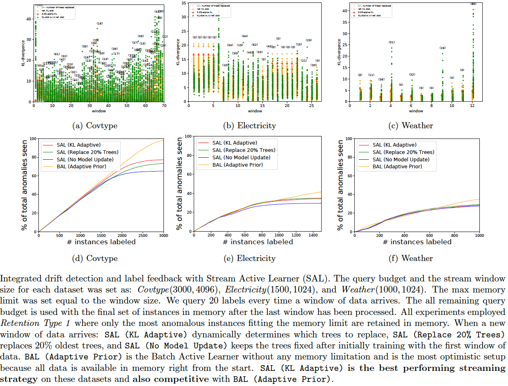

**Why actively detect data drift?** This is a valid question: *why employ active drift detection if there is reason to believe that a less expensive passive approach such as always replacing a fraction of the model will work just as well?* The reason is that, in practice, analysts want to be alerted when there is a drift (maybe because other algorithms downstream have to be retrained). Only the active [drift detection] algorithms (such as *SAL (KL Adaptive)* in the plots above) offer this ability, not the passive ones (such as *SAL (Replace 20% Trees)* and *SAL (No Tree Replace)*). Active drift detection algorithms also need to be robust (low false positives/negatives) in order to be useful.


The idea of partitioning the dataset to compute the KL-divergence threshold is motivated by: Tamraparni Dasu, Shankar Krishnan, Suresh Venkatasubramanian and Ke Yi, *An information-theoretic approach to detecting changes in multi-dimensional data streams*, Symp. on the Interface of Statistics, Computing Science, and Applications, 2006 ([pdf](https://www.cse.ust.hk/~yike/datadiff/datadiff.pdf)).


Applying drift detection to tree-based classifiers
--------------------------------------------------
The above KL-divergence based method can be applied to detect drift with tree-based classifiers such as Random Forest as well. The example [python/aad/test_concept_drift_classifier.py](python/aad/test_concept_drift_classifier.py) uses the wrapper class [RandomForestAadWrapper](python/aad/classifier_trees.py) to detect the drift with trees created by `sklearn.ensemble.RandomForestClassifier`.


Intuition behind Active Anomaly Discovery
-----------------------------------------
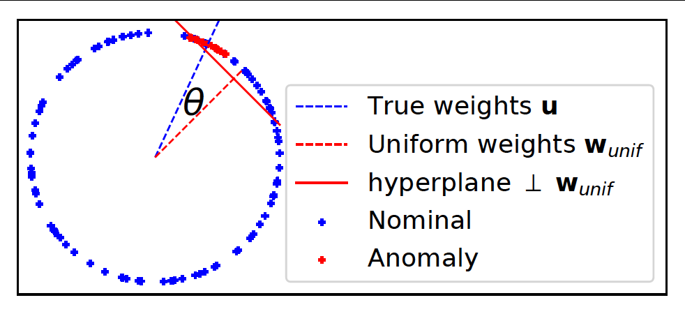

*Question: Why should active learning help in anomaly detection with ensembles?* Let us assume that the anomaly scores are uniformly distributed on a 2D unit sphere as in the above figure (this is a setting commonly analysed in active learning theory literature as it is easier to convey the intuition). Also assume that **tau** fraction of instances are anomalous. When we treat the ensemble scores as 'features', then the 'feature' vectors of anomalies will tend to be closer to the uniform unit vector than the 'feature' vectors of nominals (uniform unit vector has the same values for all 'features' and magnitude = 1). This is because anomaly detectors are **designed** to assign higher scores to anomalies. In other words, the dot product between the score vectors of anomalies and the uniform vector is higher than the dot product between the scores vectors of nominals and the uniform vector. (Note: the dot product of any vector with the uniform vector is equivalent to the arithmetic mean of the vector components up to a multiplicative const.) This is why combining scores by averaging works well.

Seen another way, the hyperplane perpendicular to the uniform weight vector and offset by `cos(pi.tau)` (in this simple 2D setting only) should be a good prior for the separating hyperplane between the anomalies and the nominals so that, *ideally*, anomalies lie at the extreme end -- the top right side of the hyperplane. The *ideal* classification rule then is: `sign(w.x - cos(pi.tau))` such that +1 is anomaly, -1 is nominal. On real-world data however, the true hyperplane normal is not exactly same as the uniform vector, but should be close (else the anomaly detectors forming the ensemble are poor). AAD is basically trying to find this true hyperplane by solving a large-margin classification problem. The example `percept.percept` illustrates this where we have true anomaly distribution (red points in the plots) displaced by a slight angle (*theta*) from the uniform weights. The true hyperplane normal is represented by the blue dashed line.

With this setup, active learning can help discover the true anomaly region on the unit sphere (centered around blue dashed line) in a more efficient manner if we set the uniform vector (red dashed line) as a prior. To understand this intuitively, observe that we can design, as discussed in the previous paragraph, a hyperplane that is displaced from the origin such that a small fraction (*tau*) of instances are on one side and the rest are on the other side. Now, note three important observations: (1) top ranked instances are close to the hyperplane, (2) since instances close to the hyperplane have the most uncertain labels, top-ranked instances lie in the region of uncertainty (from the margin perspective), and (3) ensembles are designed so that most anomalies are top-ranked in the score-space which ensures that the uniform vector is a good prior for the hyperplane normal. Selecting top-ranked instances for labeling then results in **uncertainty** sampling which makes active learning *efficient* for learning the true hyperplane (see references below). It also makes selecting top-ranked instances for labeling efficient for discovering anomalies because: if the selected instance is truly an anomaly, it is a success; on the other hand, if the instance is a nominal, labeling it still helps to efficiently adjust the margin so that future query instances are more likely to be anomalies.

**Note on the tau-based hyperplane displacement:** The hyperplane displacement `cos(pi.tau)` is assumed only for the simple 2D scenario. In a real setting, we need to estimate the hyperplane displacement from the data, as is done by AAD. Most researchers will refer to this displacement as the *bias*.

**Note on score normalization:** By design (of ensemble members), the uniform weight vector is more closely 'hugged' by the ensemble score vectors of **true anomalies** than by the ensemble score vectors of nominals. However, if the score vectors are normalized to unit length (such that they all lie on a unit sphere), then this alignment is no longer guaranteed for every type of ensemble. For example, while the unit-length normalization works well for the Isolation Forest-based model with leaf nodes as the members, it does not work for the LODA-based model with the projection vectors as the members. The intuition behind AAD, as conveyed above, **does not** actually require the score vectors to lie on a unit sphere (not even for the Isolation Forest-based model). The general anomaly score distributions are expected to look more similar to the figure below when the anomaly scores are normalized to lie in the range [0, 1] -- as is commonly done before combining the member scores. The AAD intuition works well in this situation as well without any further unit-length normalization.

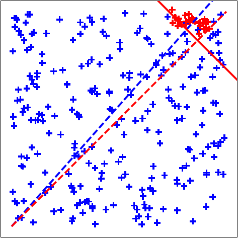

The distribution of the angles between the normalized score vectors and the uniform weight vector can be checked with aad.test_hyperplane_angles. As a recommendation: the IForest leaf-based scores may be normalized (though, not required), but LODA based scores should **not** be normalized to unit length.

**Reference(s)**:
  - David Cohn, Les Atlas, and Richard Ladner. *Improving generalization with active learning.* Machine Learning, 15(2):201–221, May 1994.
  - Maria-Florina Balcan, Andrei Z. Broder, and Tong Zhang. *Margin based active learning.* In COLT, 2007.


Timeseries Anomaly Detection
============================
The main motivation for writing these timeseries examples has been that while we can find each approach separately in other places on the web, we really should have most of them in one place to be able to compare head-to-head. **The parameter settings have been set to reasonable values, but should always be treated with a bit of skepticism since no formal model selection was employed**. The results look good with the *Airline* dataset as it was setup as the running example. However, they may be suboptimal with the other datasets (below) unless the parameters are tweaked a bit. The idea is to be able to play around with the basic timeseries modeling approaches and understand their strengths and weaknesses.

We will use the [Airline dataset](datasets/AirlinePassengers) as the running example here. The dataset can be selected with the command line option `--dataset=<name>`. Datasets included with the codebase are:
  - `airline`: [Airline dataset](datasets/AirlinePassengers)
  - `aus_beer`: [Australian beer production](datasets/AustralianBeerProduction)
  - `lynx`: [Canadian Lynx](datasets/CanadianLynx)
  - `fisher_temp`: [Fisher river temperature](datasets/FisherRiver)
  - `shampoo`: [Shampoo sales](datasets/ShampooSales)
  - `us_accident`: [US accident deaths](datasets/USAccidentalDeaths)
  - `wolf_sunspot`: [Wolf sunspot numbers](datasets/WolfSunSpot)

Timeseries forecasting generally involves the following steps (in order):
  - Exploratory analysis: Plot the timeseries and visually inspect it, employ ACF/PACF to determine lags (till how much in the past are values correlated) and seasonality.
  - Detrending: We remove the trend (i.e., monotonous increase/decrease in value) to make the series *stationary*. In most cases, subtracting each value with its previous will remove the trend.
  - Scaling: Scale values to a manageable range such as [-1, 1] so that algorithms can operate on well-conditioned values. We do this explicitly when applying our custom algorithms. Off-the-shelf forecasting algorithms such as ARIMA/SARIMA might not need this.
  - Model the normalized (detrended and scaled) time series: ARIMA/SARIMA, RNN/LSTM, Regression etc.
  - Forecast: Predict values into the future. This actually involves first predicting the normalized value and then applying inverse normalization. We will employ **rolling forecast** in the examples we present. Here, we predict only one timestep into the future. Then we get the true value and compute the **forecasting error**. Next, we append the true value to the training set and **remodel** the timeseries. This is repeated as long as desired.

Exploratory analysis
--------------------
The plots below are on the first page of the pdf generated by the command:

    pythonw -m timeseries.timeseries_arima --debug --plot --log_file=temp/timeseries/timeseries_arima.log --dataset=airline

The original series is shown on the top row of the figure. There is a clear increasing trend. We detrend the series by differencing with 1-lag (bottom row of below figure).

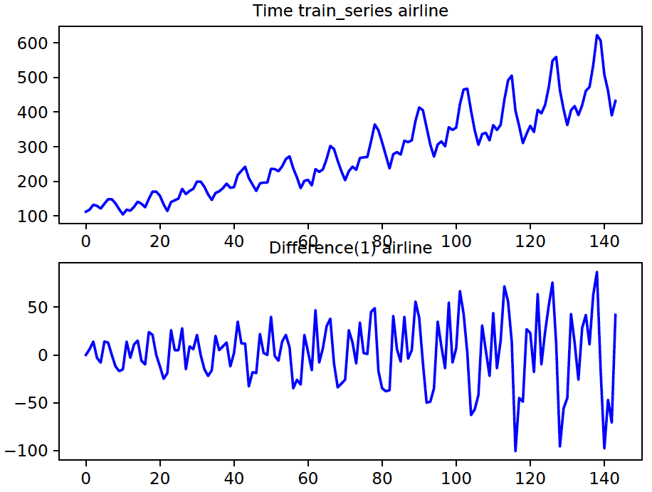

The following plots are on the second page of the pdf generated by the same command (above). The ACF (top row in the below figure) shows substantial correlation till 3-4 timepoints (or maybe less). So, let's set the autocorrelation (AR) factor to 4. The ACF plot also shows peaks every 12 time points. This indicates a *seasonality* of 12. The PACF (bottom row in the below figure) drops to around zero pretty soon. This indicates that a moving average (MA) factor of 1 is reasonable in ARIMA models. It is usually hard to determine the best AR and MA factors, which is why AIC/BIC metrics are used for proper model selection. We will skip this for now.

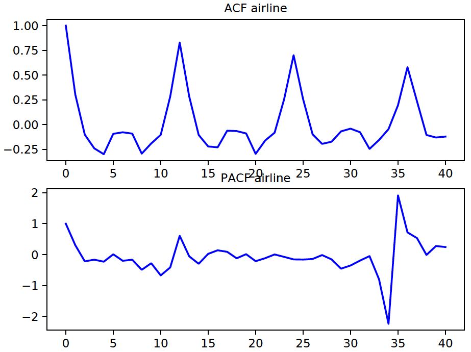

ARIMA Forecasting
-----------------
Now that we have determined the parameters for the SARIMA model, we can use them to model the timeseries and forecast. We used the first two-thirds of the series as our training set and the last one-third as the test set. The red curve in the bottom row of the below figure shows the forecast values. The green lines indicate the 10 points at which the forecast error is the highest. The top row shows the residuals when we model the *entire* timeseries with the SARIMA model. *Whether we should treat the forecast errors as anomalies would depend on the application*. The ARIMA/SARIMA orders for the example datasets are defined in [timeseries_datasets.py](python/common/timeseries_datasets.py).

```python
univariate_timeseries_datasets = {
    # "name": (path, use_cols, date_columns, index_column, ARIMA_order)
    # ARIMA_order: (AR, differences, MA, seasonality)
    "airline": TsFileDef("AirlinePassengers/international-airline-passengers.csv", [1], False, None, (4, 1, 1, 12)),
    "aus_beer": TsFileDef("AustralianBeerProduction/quarterly-beer-production-in-aus.csv", [2], False, None, (3, 1, 0, 4)),
    "lynx": TsFileDef("CanadianLynx/lynx_trappings.csv", [1], False, None, (4, 1, 1, 12)),
    "fisher_temp": TsFileDef("FisherRiver/mean-daily-temperature-fisher-ri.csv", [1], False, None, (4, 1, 0)),
    "shampoo": TsFileDef("ShampooSales/sales-of-shampoo-over-a-three-ye.csv", [1], [0], None, (5, 1, 0)),
    "us_accident": TsFileDef("USAccidentalDeaths/accidental-deaths-in-usa-monthly.csv", [1], False, None, (4, 1, 0, 12)),
    "wolf_sunspot": TsFileDef("WolfSunSpot/wolfs-sunspot-numbers-1700-1988.csv", [1], False, None, (4, 1, 1, 12))
}
```

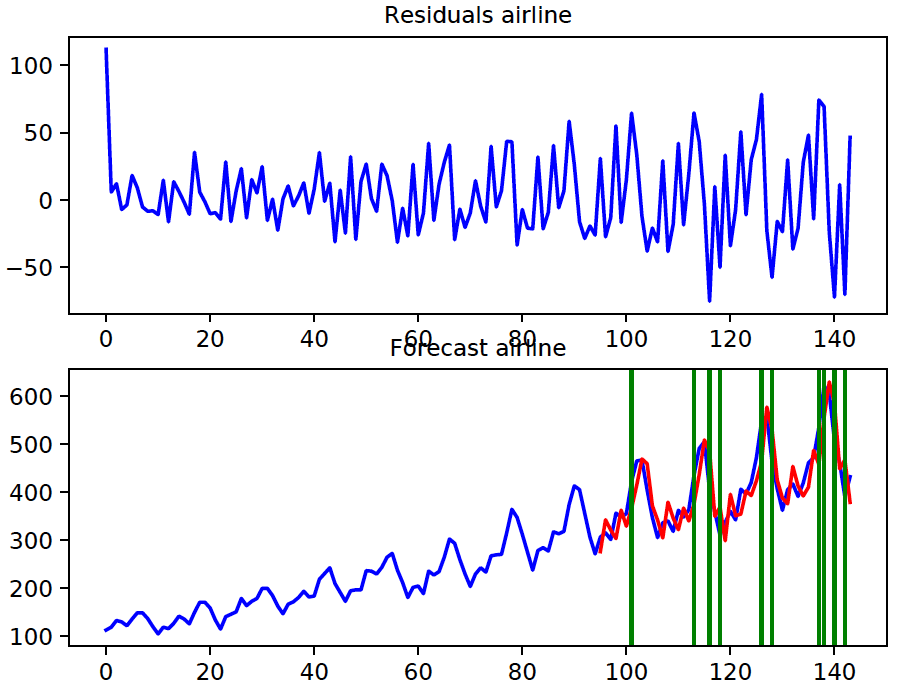

Regression Forecasting
----------------------
The idea here is to generate feature vectors which can be fed to a regression model. Specifically, if we have a timeseries *y_1, y_2, ..., y_N*, then we train a model for *y_(t+1) = f(y_(t-1), y_(t-2), .., y_(t-lag+1))*, i.e., a model that predicts the value at a particular time as a function of the previous values (till a reasonable lag). The plots below were generated with the commands:

    pythonw -m timeseries.timeseries_regression --n_epochs=200 --debug --log_file=temp/timeseries/timeseries_regression.log --normalize_trend --algo=nnsk --n_lags=12 --dataset=airline
    
    pythonw -m timeseries.timeseries_regression --n_epochs=200 --debug --log_file=temp/timeseries/timeseries_regression.log --normalize_trend --algo=rfor --n_lags=12 --dataset=airline

We show regression results with two algorithms: *Random Forest* and *Neural Network*. The section with the red curve is the forecast (test) data. Timepoints with the highest 10 errors are indicated with the green bars.

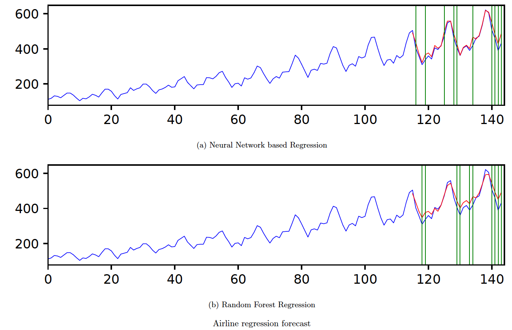


Timeseries modeling with RNNs/LSTMs
-----------------------------------
The timeseries can be modeled as sequential data with RNNs (basic cell or LSTM). The following command employs an RNN with the **basic cell**. The top row shows the original series. The blue section will be used for training, and the red section will be test. The middle section shows the scaled/normalized train and test sections. The bottom row shows that forecast after inverse normalization and the points with the highest 10 errors are indicated with the green bars.

    pythonw -m timeseries.timeseries_rnn --n_epochs=200 --debug --log_file=temp/timeseries/timeseries_rnn.log --normalize_trend --algo=basic --n_lags=12 --dataset=airline


A similar plot using an RNN with LSTM cells can be generated with the following command.
    
    pythonw -m timeseries.timeseries_rnn --n_epochs=200 --debug --log_file=temp/timeseries/timeseries_rnn.log --normalize_trend --algo=lstm --n_lags=12 --dataset=airline

The generated plots are shown below. In general, ARIMA and regression methods are probably better suited to the *Airline* dataset than the RNN models.

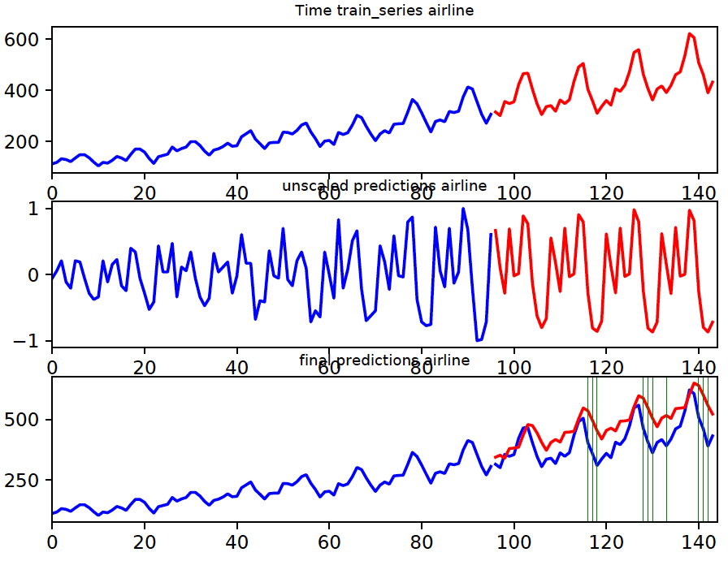


Timeseries outliers with shingles
---------------------------------
Here we illustrate the idea of anomaly detection in time series by breaking the series into windows ('shingles'), and then treating each window as i.i.d feature vector. Since we have been using the *Airline* dataset we will show the results on it here as well. However, keep in mind that this approach might **not** be the best for this dataset. Also, we do not require separate train/test sets; all the windows can be input to an unsupervised anomaly/outlier detector as a single dataset. For *Airline*, we set the window size to 6 and employ an Isolation Forest anomaly detectore. Since there is a clear trend, it is important to remove the trend before breaking up the timeseries into the smaller windows. The below command will output the plots below. The red lines in the plots show the top 10 most anomalous windows. Note that unlike the previous examples where we reported the anomalous time **points**, here we can only report the anomalous time **windows**.

    pythonw -m timeseries.timeseries_shingles --debug --plot --log_file=temp/timeseries/timeseries_shingles.log --n_lags=6 --algo=ifor --normalize_trend --dataset=airline

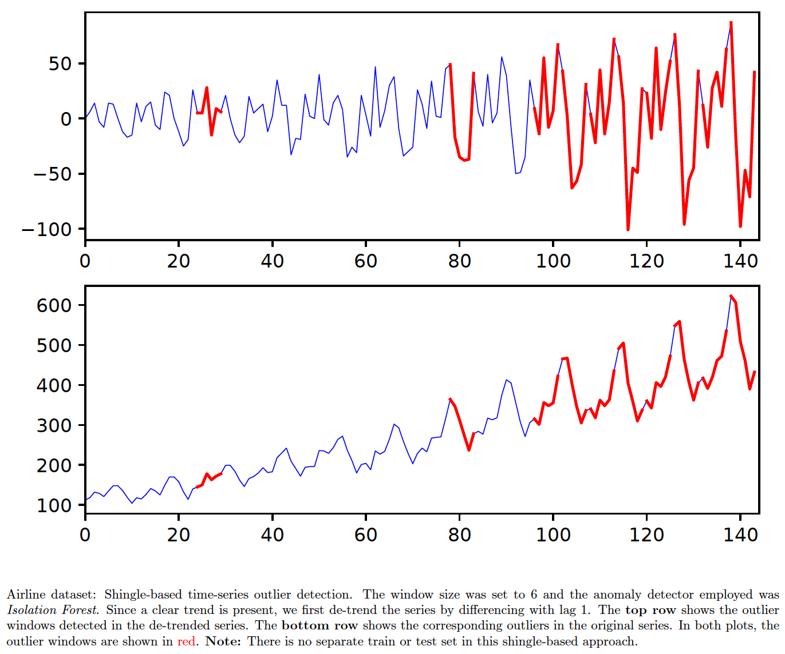

A more appropriate example might be the [simulated timeseries](datasets/simulated_timeseries). The below command breaks the timeseries into non-overlapping windows of 20 timepoints and then applies an autoencoder as the anomaly detector. The red lines show the top 10 most anomalous windows.

    pythonw -m timeseries.timeseries_shingles --debug --plot --log_file=temp/timeseries/timeseries_shingles.log --n_lags=20 --algo=autoenc --dataset=synthetic

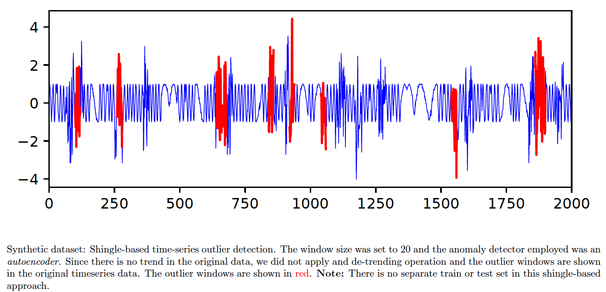


Note on Spectral Clustering by label diffusion
==============================================
Spectral clustering tries to first find a lower dimensional representation of the data where it is better clustered after taking into account the inherent manifold structures. Next, any standard anomaly detector can be applied on the new representation. Although the python code has the [implementation](python/ad/spectral_outlier.py), the last step requires non-metric MDS transform and the scikit-learn implementation is not as good as R. Hence, use the R code (R/manifold_learn.R) for generating the transformed features.

For details, refer to:
Supervised and Semi-supervised Approaches Based on Locally-Weighted Logistic Regression by Shubhomoy Das, Travis Moore, Weng-keen Wong, Simone Stumpf, Ian Oberst, Kevin Mcintosh, Margaret Burnett, Artificial Intelligence, 2013.


Activity Modeling
=================
A simple application of word2vec for activity modeling can be found [here](python/timeseries/activity_word2vec.py). We try to infer relative sensor locations from sequence of sensor triggerings. The true [floor plan](http://ailab.wsu.edu/casas/hh/hh101/profile/page-6.html) and the inferred sensor locations (**for sensor ids starting with 'M' and 'MA'**) are shown below ([download the data here](http://casas.wsu.edu/datasets/hh101.zip)). This demonstrates a form of 'embedding' of the sensors in a latent space. The premise is that the **non-iid data such as activity sequences may be represented in the latent space as i.i.d data on which standard anomaly detectors may be employed**. We can be a bit more creative and try to apply **transfer learning** with this embedding.

For example, imagine that we have a house (House-1) with labeled sensors (such as 'kitchen', 'living room', etc.) and another (House-2) with partially labeled sensors. Then, if we try to reduce the 'distance' between similarly labeled sensors in the latent space (by adding another loss-component to the word2vec embeddings), it can provide more information on which of the unlabeled sensors and activities in House-2 are similar to those in House-1. Moreover, the latent space allows representation of heterogeneous entities such as sensors, activities, locations, etc. in the same space which (in theory) helps detect similarities and associations in a more straightforward manner. In practice, the amount of data and the quality of the loss function matter a lot. Moreover, simpler methods of finding similarities/associations should not be overlooked. As an example, we might try to use embedding to figure out if a particular sensor is located in the bedroom. However, it might be simpler to just use the sensor's activation time to determine this information (assuming people sleep regular hours).

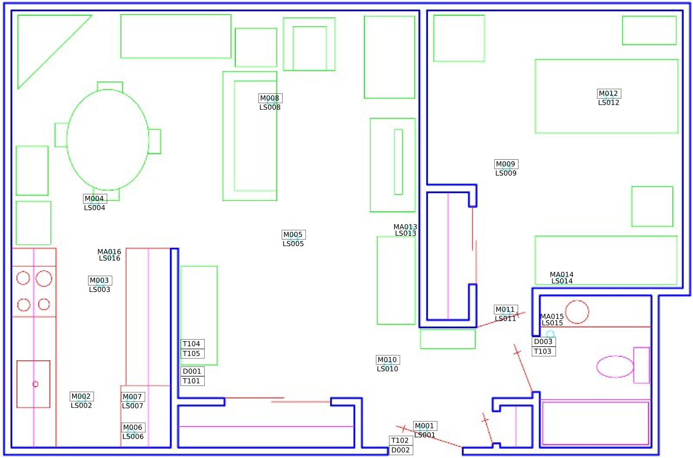

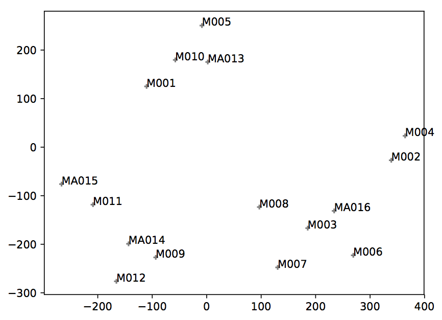

Please refer to the following paper and the [CASAS website](http://ailab.wsu.edu/casas/hh) for the setup:
    D. Cook, A. Crandall, B. Thomas, and N. Krishnan.
    CASAS: A smart home in a box. IEEE Computer, 46(7):62-69, 2013.


