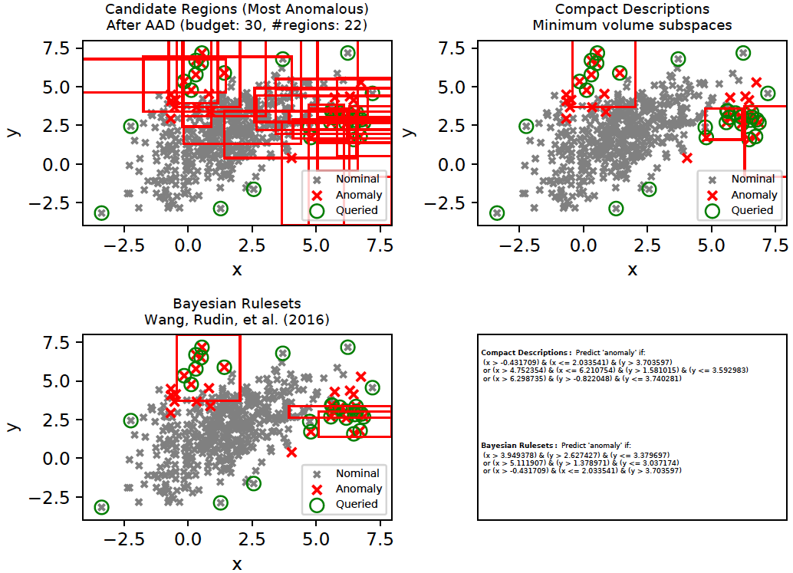
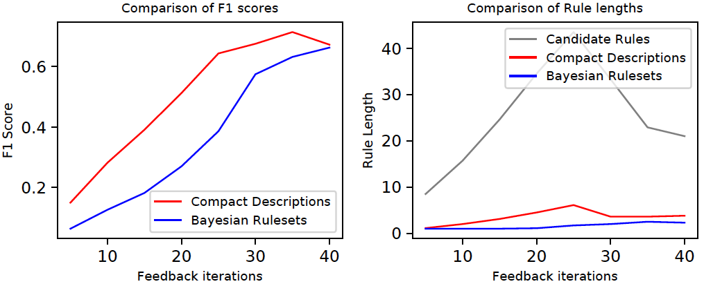
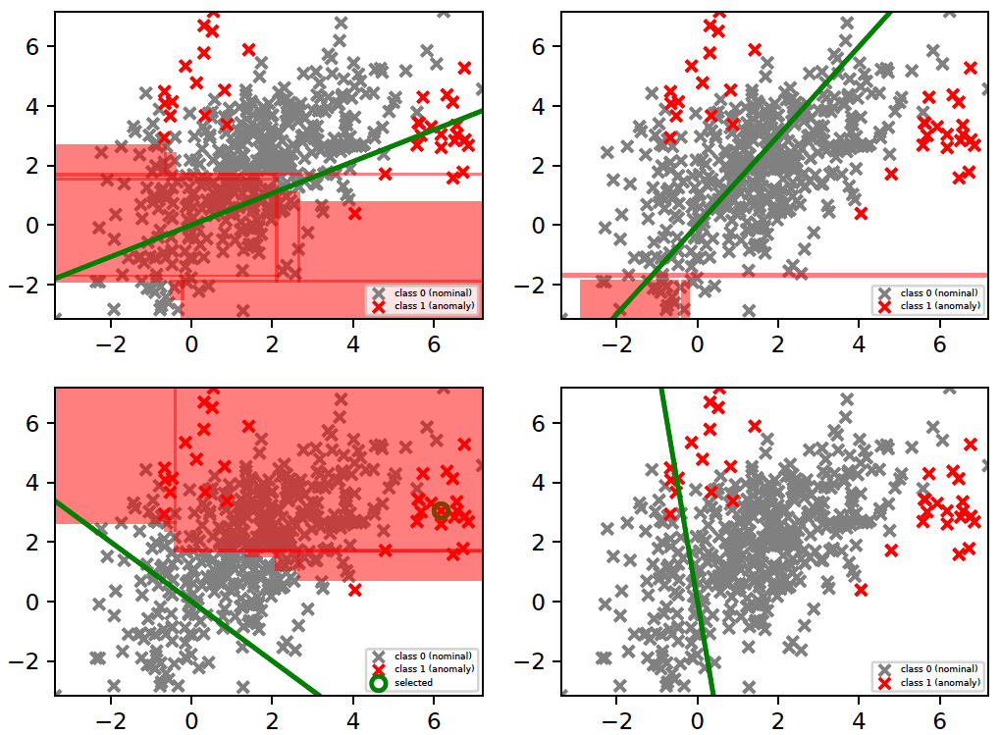
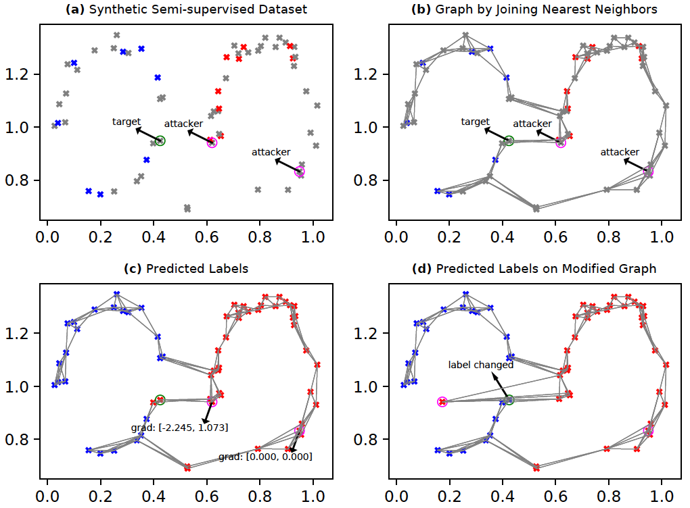
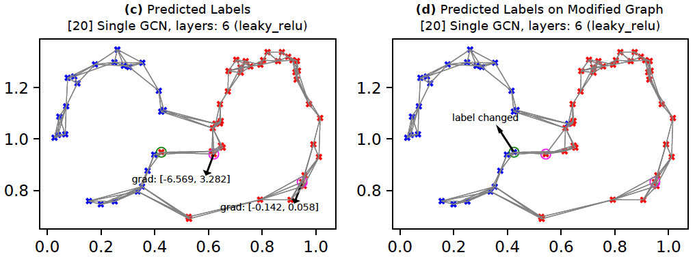
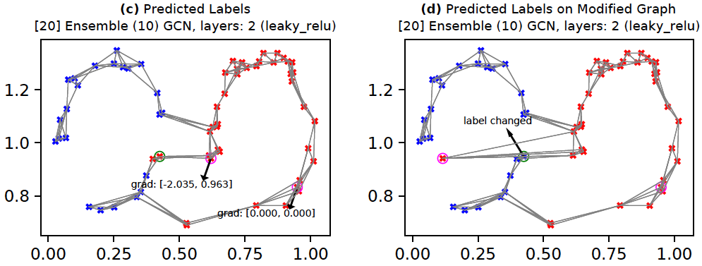
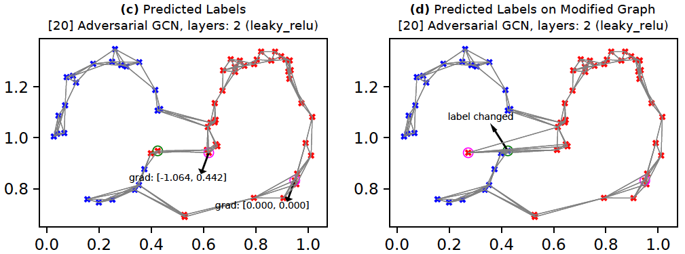

Python libraries required:
--------------------------
    six (1.16.0)
    numpy (1.26.4)
    scipy (1.13.0)
    scikit-learn (0.23.0)
    cvxopt (1.3.2)
    pandas (2.2.2)
    ranking (0.3.2)
    statsmodels (0.14.2)
    matplotlib (3.8.4)
    tensorflow (1.15.4)

`requirements.txt` lists all these libraries. To install:

    pip install -r requirements.txt


Installation with `pip`:
--------------------------

Execute the following to install the library from git.

```
pip install git+https://github.com/shubhomoydas/ad_examples.git
```

To check the installed library version:

```
pip list | grep ad-examples
```

**IMPORTANT:** In order for the logs and plots to be generated by the illustrative examples below, make sure that the current working directory has a `temp` folder.

To run demo_aad:

```
python -m ad_examples.aad.demo_aad

```

Check output:

```
baseline found:
[0, 0, 0, 1, 1, 1, 1, 1, 1, 1, 1, 1, 2, 2, 3, 3, 3, 3, 3, 4, 4, 5, 6, 6, 6, 6, 7, 8, 8, 8]
AAD found:
[0, 0, 1, 1, 1, 1, 1, 1, 1, 2, 3, 4, 5, 5, 6, 7, 7, 7, 8, 9, 9, 9, 10, 11, 12, 13, 14, 14, 14, 15]
```

To uninstall:

```
pip uninstall ad-examples
```

Jupyter notebook usage:
--------------------------
See [test_aad.ipynb](test_aad.ipynb) for sample notebook usage. This notebook code should run without the `pip install` step since the package `ad_examples` is directly under the notebook's work folder.


Note(s):
--------------------------

  1. The code has been tested with **python 3.6+**.
  
  2. Although the package has a dependency on tensorflow, it is not required for AAD and hence tensorflow will not be installed automatically.


This repository includes, among other examples, my own original research in active learning and data drift detection:
  - [AAD and HiLAD: Human in the Loop Anomaly Discovery](#active-anomaly-discovery-aad) ([cite](#cite-this-work)) (Das, Islam, et al. 2024), (Das, Wong, et al. 2020), (Das, Wong, et al. 2016), (Das, Wong, et al. 2017)
  - [GLAD: GLocalized Anomaly Detection](#glocalized-anomaly-detection) ([cite](#cite-this-work)) (Islam, Das, et al. 2020)
  - [Data drift detection](DriftDetection.md#data-drift-detection) ([cite](#cite-this-work)) (Das, Islam, et al. 2019)


Anomaly Detection Examples
==========================
This is a collection of anomaly detection examples for detection methods popular in academic literature and in practice. I will include more examples as and when I find time.

Some techniques covered are listed below. These are a mere drop in the ocean of all anomaly detectors and are only meant to highlight some broad categories. Apologies if your favorite one is currently not included -- hopefully in time...
  - i.i.d setting:
    - [Standard unsupervised anomaly detectors](ad_examples/ad/ad_outlier.py) (Isolation Forest, LODA, One-class SVM, LOF)
    - [Clustering and density-based](ad_examples/ad/gmm_outlier.py)
    - [Density estimation based](ad_examples/ad/kde_outlier.py)
    - [PCA Reconstruction-based](ad_examples/ad/pca_reconstruct.py)
    - [Autoencoder Reconstruction-based](ad_examples/dnn/autoencoder.py)
    - [Classifier and pseudo-anomaly based](ad_examples/ad/pseudo_anom_outlier.py)
    - [Ensemble/Projection-based](ad_examples/loda/loda.py)
    - [A demonstration of outlier influence](ad_examples/ad/outlier_effect.py)
    - [Spectral-based](SpectralMethods.md) [code](ad_examples/ad/spectral_outlier.py)
  - timeseries (**Jump to** [illustrations](TimeSeries.md#timeseries-anomaly-detection))
    - Forecasting-based
      - [Exploratory Analysis](TimeSeries.md#exploratory-analysis)
      - [ARIMA](TimeSeries.md#arima-forecasting)
      - [Regression](TimeSeries.md#regression-forecasting) (SVM, Random Forest, Neural Network)
      - [Recurrent Neural Networks](TimeSeries.md#timeseries-modeling-with-rnnslstms) (RNN/LSTM)
    - i.i.d
      - [Windows/Shingle based](TimeSeries.md#timeseries-outliers-with-shingles) (Isolation Forest, One-class SVM, LOF, Autoencoder)
  - [human-in-the-loop (active learning)](#active-anomaly-discovery-aad)
    - Active Anomaly Discovery ([batch setup](ad_examples/aad/aad_batch.py), [streaming setup](ad_examples/aad/aad_stream.py)) -- **Includes plots and illustrations (see sections below)**
      - [High-level summary of the approach](#active-anomaly-discovery-aad)
      - [Cite this work](#cite-this-work)
      - **Jump right in:** [General instructions on running AAD](#running-aad)
      - **Descriptions and Interpretability:** [Generating anomaly descriptions with tree-based ensembles](#generating-compact-descriptions-with-aad)
      - [Bayesian Rulesets with AAD](#bayesian-rulesets-with-aad)
      - **Query strategies:** [Diversifying query instances using the descriptions](#query-diversity-with-compact-descriptions) and its [evaluation](#does-query-diversity-with-compact-descriptions-help)
      - **GLAD: GLocalized Anomaly Detection** ([glad_batch.py](ad_examples/glad/glad_batch.py))
        - [Approach and architecture](#glocalized-anomaly-detection)
      - **Aside:** [When we have a lot of labeled data (both anomalies and nominals), should we employ a classifier instead of an anomaly detector?](#anomaly-detector-vs-classifier)
      - [Some properties of different tree-based detectors](TreeProperties.md)
      - [Running AAD with precomputed ensemble scores](#running-aad-with-precomputed-anomaly-scores)
      - **API Usage:** [How to employ AAD in your own application](#how-to-employ-aad-in-your-own-application)
      - [Comparing AAD with related work](CompareRelated.md#comparison-with-related-work)
      - [Data drift detection and model update with streaming data](DriftDetection.md#data-drift-detection)
      - **Aside:** [Applying drift detection to tree-based classifiers](DriftDetection.md#applying-drift-detection-to-tree-based-classifiers)
      - [A bit of theoretical intuition](Motivations.md#motivation-for-ensemble-based-active-anomaly-discovery)
  - [Generative Adversarial Nets (GAN) based Anomaly Detection](#gan-based-anomaly-detection)
    - [AnoGAN](#anogan)
  - [Anomaly injection by adversarial behavior and Graph Convolutional Networks](#graph-convolutional-network)
    - [Ensembles](#robustness-with-ensembles)
    - [Adversarial training](#robustness-with-adversarial-training)
  - [Reducing activity sequences to i.i.d](ActivitySequences.md#activity-modeling) -- This illustrates an approach that is becoming increasingly popular as a starting-point for anomaly detection on activity sequences and transfer learning.

There are other important data types/scenarios such as *static and dynamic graphs* ([(Akoglu, Tong, Koutra 2015)](https://arxiv.org/pdf/1404.4679.pdf), [(Bhatia, S. et al. 2020)](https://github.com/bhatiasiddharth/MIDAS)) where anomaly detection is highly relevant for real-world applications, but which are not covered in this repository. Interested readers may instead refer to the references provided.

There are multiple datasets (synthetic/real) supported. Change the code to work with whichever dataset or algorithm is desired. Most of the demos will output pdf plots under the 'temp' folder when executed.

**AUC** is the most common metric used to report anomaly detection performance. See [here](ad_examples/dnn/autoencoder.py) for a complete example with standard datasets.

To execute the code:

1. **Run code from the checkout folder**. The outputs will be generated under 'temp' folder.

2. To avoid import errors, make sure that `PYTHONPATH` is configured correctly to include the ad_examples source dir: `.:/usr/local/lib/python`

3. *The run commands are at the top of the python source code files.*

4. Check the log file in `temp` folder. Usually it will be named <demo_code>.log. Timeseries demos will output logs under the `timeseries` folder.


Active Anomaly Discovery (AAD)
==============================
This codebase replaces the older 'pyaad' project (https://github.com/shubhomoydas/pyaad). It implements an algorithm (AAD) to actively explore anomalies.


**Motivation and intuition**

Our motivation for exploring active anomaly detection with ensembles is presented in [Motivations.md](Motivations.md#motivation-for-ensemble-based-active-anomaly-discovery).


**Approach**

The approach is explained in more detail in [(Das, S., Islam, R., et al. 2019)](https://arxiv.org/pdf/1901.08930.pdf).


**Demonstration of the basic idea**

*Assuming that the ensemble scores have already been computed*, the demo code [percept.py](https://github.com/shubhomoydas/ad_examples/blob/master/ad_examples/percept/percept.py) implements AAD in a much more simplified manner.

To run [percept.py](https://github.com/shubhomoydas/ad_examples/blob/master/ad_examples/percept/percept.py):

    python -m ad_examples.percept.percept

The above command will generate a [pdf file](https://github.com/shubhomoydas/ad_examples/blob/master/documentation/percept_taurel_fixedtau_prior.pdf) with plots illustrating how the data was actively labeled.


**Reference(s)**:
  - Das, S., Islam, R., Jayakodi, N.K. and Doppa, J.R. (2024). *Effectiveness of Tree-based Ensembles for Anomaly Discovery: Insights, Batch and Streaming Active Learning*, Journal of Artificial Intelligence Research 80 (2024) 127-172. [(pdf)](https://arxiv.org/pdf/1901.08930) (**This is the most comprehensive version.**)

  - Das, S., Wong, W-K., Dietterich, T., Fern, A. and Emmott, A. (2020). *Discovering Anomalies by Incorporating Feedback from an Expert*, ACM Transactions on Knowledge Discovery from Data (TKDD) 14, 4, Article 49 (July 2020), 32 pages. DOI:https://doi.org/10.1145/3396608.

  - Islam, R., Das, S., Doppa, J.R., Natarajan, S. (2020). *GLAD: GLocalized Anomaly Detection via Human-in-the-Loop Learning*. Workshop on Human in the Loop Learning at 37th International Conference on Machine Learning (ICML) [(pdf)](https://arxiv.org/pdf/1810.01403.pdf)

  - Das, S., Islam, R., Jayakodi, N.K. and Doppa, J.R. (2018). *Active Anomaly Detection via Ensembles*. [(pdf)](https://arxiv.org/pdf/1809.06477.pdf)

  - Das, S., Wong, W-K., Fern, A., Dietterich, T. and Siddiqui, A. (2017). *Incorporating Feedback into Tree-based Anomaly Detection*, KDD Interactive Data Exploration and Analytics (IDEA) Workshop. [(pdf)](https://arxiv.org/pdf/1708.09441)[(presentation)](https://github.com/shubhomoydas/pyaad/blob/master/presentations/IDEA17_slides.pptx)

  - Das, S., Wong, W-K., Dietterich, T., Fern, A. and Emmott, A. (2016). *Incorporating Expert Feedback into Active Anomaly Discovery* in the Proceedings of the IEEE International Conference on Data Mining. [(pdf)](http://web.engr.oregonstate.edu/~wongwe/papers/pdf/ICDM2016.AAD.pdf)[(presentation)](https://github.com/shubhomoydas/aad/blob/master/overview/ICDM2016-AAD.pptx)

  - Das, S. (2017). *Incorporating User Feedback into Machine Learning Systems*, [PhD Thesis](http://ir.library.oregonstate.edu/concern/graduate_thesis_or_dissertations/9019s7533) [(pdf)](https://ir.library.oregonstate.edu/downloads/m900p057t) -- The work on AAD in this repository was developed during my PhD and Post-doctoral research.

  - Akoglu, L., Tong, H. and Koutra, D. (2015). *Graph based anomaly detection and description: a survey*, Data Mining and Knowledge Discovery. [(pdf)](https://arxiv.org/pdf/1404.4679.pdf)

  - Bhatia, S., Hooi, B., Yoon, M., Shin, K., Faloutsos, C. (2020). *MIDAS: Microcluster-Based Detector of Anomalies in Edge Streams*. [(pdf)](https://arxiv.org/pdf/1911.04464.pdf) [(code)](https://github.com/bhatiasiddharth/MIDAS)
  

Cite this work
--------------
In case you find this **repository** useful or use in your own work, please cite it with the following BibTeX references:
```
@article{das:2020,
	author = {Das, Shubhomoy and Wong, Weng-Keen and Dietterich, Thomas and Fern, Alan and Emmott, Andrew},
	title = {Discovering Anomalies by Incorporating Feedback from an Expert},
	year = {2020},
	issue_date = {July 2020},
	publisher = {Association for Computing Machinery},
	volume = {14},
	number = {4},
	issn = {1556-4681},
	url = {https://doi.org/10.1145/3396608},
	doi = {10.1145/3396608},
	journal = {ACM Trans. Knowl. Discov. Data},
	month = jun,
	articleno = {49},
	numpages = {32}
}

@article{das:2024,
    author = {Shubhomoy Das and Md Rakibul Islam and Nitthilan Kannappan Jayakodi and Janardhan Rao Doppa},
    title = {Effectiveness of Tree-based Ensembles for Anomaly Discovery: Insights, Batch and Streaming Active Learning},
    year = {2024},
    issue_date = {May 2024},
    volume = {80},
    journal = {J. Artif. Int. Res.},
    month = {may},
    numpages = {46},
    pages = {127--172}
}

@misc{github:shubhomoydas:ad_examples,
    author = {Shubhomoy Das},
    title = {Active Anomaly Discovery},
    year = {2018},
    journal = {arXiv:1708.09441},
    howpublished = {\url{https://github.com/shubhomoydas/ad_examples}},
    note = {[Online; accessed 19-Sep-2018]}
}
```

Other publications may be cited as:
```
@article{islam:2020b,
    author = {Md Rakibul Islam and Shubhomoy Das and Janardhan Rao Doppa and Sriraam Natarajan},
    title = {GLAD: GLocalized Anomaly Detection via Human-in-the-Loop Learning},
    year = {2020},
    booktitle={ICML Workshop on Human in the Loop Learning},
    howpublished = {\url{https://arxiv.org/abs/1810.01403}},
    note = {[Online; accessed 15-Jul-2020]}
}

@article{das:2018a,
    author = {Shubhomoy Das and Md Rakibul Islam and Nitthilan Kannappan Jayakodi and Janardhan Rao Doppa},
    title = {Active Anomaly Detection via Ensembles},
    year = {2018},
    journal = {arXiv:1809.06477},
    howpublished = {\url{https://arxiv.org/abs/1809.06477}},
    note = {[Online; accessed 19-Sep-2018]}
}

@inproceedings{das:2016,
    author={Shubhomoy Das and Weng-Keen Wong and Thomas G. Dietterich and Alan Fern and Andrew Emmott},
    title={Incorporating Expert Feedback into Active Anomaly Discovery},
    booktitle={IEEE ICDM},
    year={2016}
}

@inproceedings{das:2017,
    author={Shubhomoy Das and Weng-Keen Wong and Alan Fern and Thomas G. Dietterich and Md Amran Siddiqui},
    title={Incorporating Expert Feedback into Tree-based Anomaly Detection},
    booktitle={KDD IDEA Workshop},
    year={2017}
}

```


Running AAD
-----------
This codebase is my **research** platform. The main `bash` script `aad.sh` makes it easier to run all AAD experiments multiple times (in the spirit of scientific inquiry) so that final results can be averaged. I try to output results for different parameter settings into different folders (under `temp/aad`) so that results can be easily compared without conflicts. I also output to files the instance indexes (as 1-indexed and **not** 0-indexed) in the order they were queried for fine-grained analysis and visualization. If you want to introduce a new dataset with the least effort, then put its files under `ad_examples/datasets/anomaly` folder in the same format and structure as those of the `toy2` dataset and follow the same naming conventions. Else, a little effort would be needed to invoke the necessary data load APIs. You might also want to have a look at the [simplified API usage example](#how-to-employ-aad-in-your-own-application) (`ad_examples/aad/demo_aad.py`) below.

**Note:** It might seem that the script `aad.sh` requires an intimidating number of parameters, but bear in mind that the simplest settings (or automatic configuration from cross-validation etc.) are preferred for any formal publication. **The reason we allow so many parameters to be configurable is to support ablation studies and general curiosity.**

This codebase supports the following five different anomaly detection algorithms. If pre-computed anomaly scores are available from another ensemble-based algorithm, then jump to the [below section on pre-computed scores](#running-aad-with-precomputed-anomaly-scores).
  - The [LODA based AAD](ad_examples/aad/loda_aad.py) (**works with streaming data, but does not support incremental update to model after building the model with the first window of data**)
  - The [Isolation Forest based AAD](ad_examples/aad/random_split_trees.py) (**streaming support with model update**)
    - For streaming update, we support two modes:
      - **Mode 0**: Replace the oldest 20% trees (configurable) with new trees trained on the latest window of data. The previously learned weights of the nodes of the retained (80%) trees are retained, and the weights of nodes of new trees are set to a default value (see code) before normalizing the entire weight vector to unit length. For this mode, set `CHECK_KL_IND=0` in `aad.sh`.
      - **Mode 1** (Default): Replace trees based on KL-divergence. Further details are [below](#data-drift-detection). For this mode, set `CHECK_KL_IND=1` in `aad.sh`.
  - [HS Trees based AAD](ad_examples/aad/random_split_trees.py) (**streaming support with model update**)
    - For streaming update, the option `--tree_update_type=0` replaces the previous node-level sample counts with counts from the new window of data. This is as per the original published algorithm. The option `--tree_update_type=1` updates the node-level counts as a linear combination of previous and current counts -- this is an experimental feature.
  - [RS Forest based AAD](ad_examples/aad/random_split_trees.py) (**streaming support with model update**)
    - See the previous HS Trees streaming update options above.
  - The [Isolation Forest based AAD with Multiview](ad_examples/aad/multiview_forest.py) (**streaming support with model update**)
    - This is useful if (say) there are groups of features that represent coherent groups and we want to create trees only with the features in a particular group. For instance, in a malware detection application, we might have 100 features computed with static program features and 120 computed with dynamic program features. Then we want 50 isolation trees with only the 100 static features and 50 trees with the 120 dynamic features for a total of 100 trees. In a streaming situation, we would want the tree replacement to take into account the grouping as well, for example, if there has been no drift in the static features while there is a significant drift in dynamic features, we should not replace the trees of static features and only replace the trees of dynamic features.

To run the Isolation Forest / HS-Trees / RS-Forest / LODA based algorithms, the command has the following format (**remember to run the commands from the 'python' folder, and monitor progress in logs under 'temp' folder**):

    bash ./aad.sh <dataset> <budget> <reruns> <tau> <detector_type> <query_type[1|2|8|9]> <query_confident[0|1]> <streaming[0|1]> <streaming_window> <retention_type[0|1]> <with_prior[0|1]> <init_type[0|1|2]>

    for Isolation Forest, set <detector_type>=7; 
    for HSTrees, set <detector_type>=11;
    for RSForest, set <detector_type>=12;
    for LODA, set <detector_type>=13;
    for Isolation Forest Multiview, set <detector_type>=15;

Example (with Isolation Forest, non-streaming):

    bash ./aad.sh toy2 35 1 0.03 7 1 0 0 512 0 1 1

Note: The above will generate 2D plots (tree partitions and score contours) under the `temp` folder since *toy2* is a 2D dataset.

example (with HSTrees streaming):

    bash ./aad.sh toy2 35 1 0.03 11 1 0 1 256 0 1 1

**Note:** I **recommend using Isolation forest** instead of HSTrees and RSForest even if there is drift in data:

    bash ./aad.sh toy2 35 1 0.03 7 1 0 1 512 1 1 1


**Note on Streaming:**

Streaming currently supports two strategies for data retention:
  - Retention Type 0: Here the new instances from the stream completely overwrite the older *unlabeled instances* in memory.
  - Retention Type 1: Here the new instances are first merged with the older unlabeled instances and then the complete set is sorted in descending order on the distance from the margin. The top instances are retained; rest are discarded. **This is highly recommended.**


**Note on Query Strategies:**

See [below](#does-query-diversity-with-compact-descriptions-help) for query strategies currently supported. `QUERY_TYPE` variable in `aad.sh` determines the query strategy. One of the strategies discussed in detail below is to diversify queries using [descriptions](#query-diversity-with-compact-descriptions). This is invoked by `QUERY_TYPE=8` option. To actually see the benefits of this option, set the query batch size to greater than 1 (e.g., 3) (variable `N_BATCH` in `aad.sh`).


**Note on pre-training AAD with a set of labeled instances:**

Suppose that `m` pre-labeled instances are already available *before* starting the active learning loop. Then, it is recommended to run `min(20, m)` iterations of `Aad.update_weights()` with the pre-labeled instances before getting more feedback. This is because AAD requires inferring both the weight-parameters `w` and the tau-th quantile score `q-tau`. These cannot be inferred by the optimization all at once. By running the update a few times, both `w` and `q-tau` stabilize. During the active learning cycle, `w` and `q-tau` get updated gradually by invoking `Aad.update_weights()` only once with each new label, and lets the parameters stabilize through all the (multiple) calls to `Aad.update_weights()` over the entire budget.


Generating compact descriptions with AAD
-------------------------------------------
AAD, when used with a forest-based detector such as Isolation Forest, can output a compact set of subspaces that contain all labeled anomalies. The idea is explained in [(Das, Islam, et al. 2019)](#cite-this-work). Following illustrations show the results of this approach.

**Note:** The algorithm to compute compact descriptions (as illustrated here) might also be considered to be a non-parametric clustering algorithm where each 'description' is a cluster.
  
To generate the below, use the command:
    
    bash ./aad.sh toy2 35 1 0.03 7 1 0 0 512 0 1 1


Bayesian Rulesets with AAD
-------------------------------------------
As we saw above, AAD helped infer the true relevance of subspaces and the most relevant subspaces were then employed as candidates for compact descriptions. This approach can be applied with other rule-mining algorithms such as (Wang, Rudin, et al. 2016) as well. (Wang, Rudin, et al. 2016) is a supervised algorithm that is first initialized with a [modestly] large set of classification rules. It then infers a much smaller subset of interpretable rules from the initial set of rules using a Bayesian framework. We will refer to these rules as **Bayesian Rulesets** (in contrast with our *Compact Descriptions*). The following command generates the plots below and illustrates both *Compact Descriptions* and *Bayesian Rulesets*. Here, we first run AAD with a budget of 30 and retrieve the top subspaces which cover all *discovered* anomalies. These subspaces (top left plot) are used as candidates for both *Compact Descriptions* (top right plot) as well as *Bayesian Rulesets* (bottom left plot). The discovered rules which imply **Anomaly** are shown in the bottom right plot. Since *Bayesian Rulesets* is supervised, we take the set of queried instances, and another set of randomly sampled unlabeled instances (having same size as queried) as the training set. The sampled unlabeled instances selected for training are assumed to be **nominal**.

    python -m ad_examples.aad.test_rulesets



A comparison of **interpretable** rules found by *Compact Descriptions (CD)* and *Bayesian Rulesets (BR)* is shown below for the *toy2* dataset. Interpretability implies that the rules will be simple-enough for an analyst to understand. Such rules generally have shorter lengths (fewer predicates). The application of compact descriptions in the case of diversity only involved a set-covering problem without any regard to interpretability. Now, we modify the ILP (integer linear programming) objective in the following manner (see [CompactDescriber.describe()](ad_examples/aad/forest_description.py)):

  1. We add a **complexity** penalty to each region. A region is defined by its feature ranges, i.e., the max and min values of each feature within the region. A feature range that does not have either a minimum or a maximum value (i.e., they are `-inf` or `inf`) makes the corresponding region definition simpler because it implies that fewer predicates will be required to define the region. Our complexity definition encourages selection of regions which have fewer feature range values in their definition.
  2. We set a minimum precision threshold (defaults to 0.4) for the rules selected. This removes noisy rules.
  3. Whenever a negative (nominal) example gets included within a region, we penalize it by the volume of the corresponding region. This encourages selection of regions with fewer false positives.

We generate the rules by both techniques (*CD* and *BR*) at regular points in the feedback cycle and compute the F1 score on the entire dataset (top left plot below). These results were averaged over 10 independent runs. *CD* and *BR* are generally competitive. A decomposition of the F1 score shows that *CD* usually has a lower precision, but higher recall than *BR*. The bottom row shows that *CD* usually selects **simpler** rules (i.e., smaller length) than *BR* in order to describe the anomalies. The grey curve (bottom row middle, labeled 'Candidate Rules') is the total number of rules available in a feedback cycle. Both *CD* and *BR* use the same set of candidate rules. A slightly smaller subset of the candidate rules were selected by *BR* than *CD* to describe most anomalies.

**Important:** The results have been presented here only for the *toy2* dataset because we have used this as the running example. The results differ by the dataset, but the general patterns pointed out above seem to hold on the real-world datasets as shown in the document [all-rule_analysis.pdf](documentation/rules/all-rule_analysis.pdf).

In order to generate the plots below, first set `RULES_IND=1` and `RULE_OUTPUT_INTERVAL="--rule_output_interval=5"` in `aad.sh`, and then execute the following commands:

    bash ./aad.sh toy2 40 10 0.03 7 1 0 0 512 0 1 1
    bash ./aad.sh toy2 40 10 0.03 7 1 0 3 512 0 1 1




**Rule expressions**

The codebase uses a very light-weight rule/predicate framework. The conjunctive rules (used by the description algorithms) are composed of a series of `Predicate` objects and operations on these are encapsulated in `ConjunctiveRule`. In order to understand and debug these data structures, please see `test_rule_apis()` in [expressions.py](ad_examples/common/expressions.py) and the [tutorial](ad_examples/common/expressions_tutorial.py). The rule framework has been introduced primarily to provide a higher-level abstraction for rulesets so that programming bugs may be avoided.

**Reference(s)**:
  - Wang, T., Rudin, C., Velez-Doshi, F., Liu, Y., Klampfl, E., MacNeille, P. (2016). *Bayesian Rule Sets for Interpretable Classification* in the Proceedings of the IEEE International Conference on Data Mining.


Applications of compact descriptions
------------------------------------
Compact descriptions (or Bayesian rulesets) have multiple uses including:
  - Discovery of diverse classes of anomalies very quickly by querying instances from different subspaces of the description
  - Improved interpretability of anomalous instances

We assume that in a practical setting, the analyst(s) will be presented with instances along with their corresponding description(s). Additional information can be derived from the descriptions and shown to the analyst such as the number of instances in each description, which can help prioritize the analysis. Unfortunately, most uses of descriptions are subjective or application dependent, and therefore, hard to evaluate. However, we can evaluate the improvement in query [diversity](#query-diversity-with-compact-descriptions) objectively as we do [below](#does-query-diversity-with-compact-descriptions-help).


Query diversity with compact descriptions
-----------------------------------------
The idea for querying a diverse set of instances without significantly affecting the anomaly detection efficiency is explained in [(Das, Islam, et al. 2019)](#cite-this-work).

To generate the below, use the command:
    
    bash ./aad.sh toy2 10 1 0.03 7 1 0 0 512 0 1 1


Does Query diversity with compact descriptions help?
----------------------------------------------------
We compare the following query strategies (variables `QUERY_TYPE, N_BATCH, N_EXPLORE` are set in `aad.sh`):
  - **Select the single-most anomalous instance per feedback iteration:** (`QUERY_TYPE=1, N_BATCH=1`) [Select](ad_examples/aad/query_model.py) the top-most instance ordered by anomaly score. (**BAL (Adaptive Prior)** in the plots below.)
  - **Select a set of the top-most anomalous instances per feedback iteration:** (`QUERY_TYPE=1, N_BATCH=3`) [Select](ad_examples/aad/query_model.py) a batch of three top-most instances ordered by anomaly score. (**ifor\_q1b3** in the plots below.)
  - **Select a random subset of the most anomalous instances per feedback iteration:** (`QUERY_TYPE=2, N_BATCH=3, N_EXPLORE=10`) [Select](ad_examples/aad/query_model.py) a random batch of three instances among top 10 anomalous instances. (**ifor\_top\_random** in the plots below.)
  - **Select a subset of most anomalous instances whose descriptions are diverse within a feedback iteration:** (`QUERY_TYPE=8, N_BATCH=3, N_EXPLORE=10`) [Select](ad_examples/aad/query_model_other.py) three instances among top 10 anomalous instances which have most diverse descriptions (explained in [previous section](#query-diversity-with-compact-descriptions)). (**BAL-D** in the plots below.)
  - **Select a subset of most anomalous instances which are farthest from each other within a feedback iteration:** (`QUERY_TYPE=9, N_BATCH=3, N_EXPLORE=10`) [Select](ad_examples/aad/query_model_euclidean.py) three instances among the top 10 anomalous instances which have the highest average euclidean distance between them. First short-list the top 10 anomalous instances as candidates. Now, to select a batch of (three) instances, first add the most anomalous instance from these candidates to the selected list. Then iterate (two more times); in each iteration, add that instance (from the candidates) to the selected list which has the maximum average distance from the instances currently in the selected list. This is a diversity strategy common in existing literature. (**BAL-E** in the plots below.)

The plots below show that the description-based diversity strategy `BAL-D` indeed helps. While selecting the top-most anomalous instances is highly label-efficient for discovering anomalies [(Das, Islam, et al. 2019)](#cite-this-work), we can also improve the diversity in each query-batch through descriptions without loss in efficiency. Employing descriptions for diversity (`BAL-D`) also has similar query diversity on the *toy2* dataset as that which maximizes the euclidean distance (`BAL-E`); however, the description based strategy `BAL-D` has the advantage of being more user-friendly because it can characterize multiple anomalies through the descriptions.

To generate the below plots, perform the following steps (**remember to run the commands from the 'python' folder, and monitor progress in logs under 'temp' folder**):

    - set N_BATCH=1 in aad.sh and then run the command:
    
        bash ./aad.sh toy2 45 10 0.03 7 1 0 0 512 0 1 1
        
    - set N_BATCH=3 in aad.sh, and run the following commands:
    
        bash ./aad.sh toy2 45 10 0.03 7 1 0 0 512 0 1 1
        bash ./aad.sh toy2 45 10 0.03 7 2 0 0 512 0 1 1
        bash ./aad.sh toy2 45 10 0.03 7 8 0 0 512 0 1 1
        bash ./aad.sh toy2 45 10 0.03 7 9 0 0 512 0 1 1

    - Next, generate anomaly discovery curves:
        
        python -m ad_examples.aad.plot_aad_results
        
    - Finally, generate class diversity plot:
    
        python -m ad_examples.aad.plot_class_diversity


GLocalized Anomaly Detection
------------------------------
**Glocal** ([according to Wikipedia](https://en.wikipedia.org/wiki/Glocal)): *reflecting or characterized by both local and global considerations*.

End-users find it easier to trust algorithms they understand and are familiar with. Such algorithms are typically built on broadly general and simplifying assumptions over the entire feature space (i.e., *global* behavior), which might not be applicable universally (i.e., not relevant *locally* in some parts of the feature space) in an application domain. This observation is true of most machine learning algorithms including those for anomaly detection. **GL**ocalized **A**nomaly **D**etection (GLAD) was designed to allow a human analyst to continue using anomaly detection ensembles with global behavior by learning their local relevance in different parts of the feature space via label feedback.

While the approach (outlined below) uses dynamic weighted ensembles, the key idea behind GLAD is to place a **uniform prior over the input space**. This is in contrast with other algorithms which place priors on the *parameter space* (e.g., using an L1 or L2 regularizer for the parameters). We can potentially apply similar priors in other algorithms, especially in explore-exploit situations, and is open for research.


**The usage of priors cannot be overstated in human-in-the-loop algorithms.** Any person who has to inspect the data one-by-one, usually does so (or **wants to do so**) in a *systematic* manner. It is therefore an imperative for the machine learning algorithms that they be predictable and let the user follow their system. **Priors** help setup this system in a principled manner. GLAD places a prior on the input space such that analysts can expect that they will be presented instances (somewhat) in accordance with the baseline anomaly scores while also providing feedback. Without the prior, the order in which instances are presented could vary a lot.

We might consider GLAD as very similar to the tree-based AAD we saw above. Tree-based AAD chops up the feature space into discrete subspaces and then places an uniform prior over the subspaces (i.e., the uniform weight vector). Now, if we take this view to an extreme and imagine that each point represents a subspace, we can see the connection to GLAD. While the tree-based AAD assigned the discrete subspace scores to the instances (e.g., it was the node depth for Isolation Forest), the scores assigned by GLAD are continuous, defined by the ensemble members. The *relevance* in GLAD is analogous to the *learned weights* in the tree-based AAD.

The architecture of GLAD is shown below.


The results on the *Toy2* dataset are shown below. In order to generate these figures, run the following commands:
    
    python -m ad_examples.glad.test_glad --log_file=temp/glad/test_glad.log --debug --dataset=toy2 --n_anoms=60 --loda_debug --plot --op=unit
    
    python -m ad_examples.glad.glad_batch --log_file=temp/glad/glad_batch.log --debug --dataset=toy2 --n_epochs=200 --budget=60 --loda_debug --plot


**GLAD Explanations**

To help the analyst understand the anomaly detector result, we have used the concept of '*descriptions*' for the tree-based algorithms above. We now introduce the concept of '*explanations*'. While both seem similar, they are actually quite different:
  1. **Description:** A description generates a compact representation for a group of instances. The main application is to reduce the cognitive burden on the analysts.
  2. **Explanation:** An explanation outputs a reason why an instance was assigned a high score. Usually, we limit the scope of an explanation to one instance. The main application is to diagnose the model: whether the detector(s) are working as expected.

GLAD assumes that the anomaly detectors in the ensemble can be arbitrary. The best it can offer as an explanation is the member which is most relevant for a test instance. With this in mind, we can employ the following strategy:
  1. Employ the AFSS network to predict the relevance of individual ensemble members on the complete dataset.
  2. Find the instances for each ensemble member for which that member is the **most** relevant. Mark these instances as *positive* and the rest as *negative*.
  3. Train a separate decision tree for each member to separate the corresponding positives and negatives.

**Important**: The approach we now present assumes that the explanation library LIME (Ribeiro et al. 2016) is installed. If not, install it with `pip install lime`.

The above strategy is intended to provide a set of interpretable rules for the relevance of a specific ensemble member (detector) in the feature space. This is illustrated in the figure below. These plots were generated by running the following with python 3.6.

    python -m ad_examples.glad.glad_batch --log_file=temp/glad/glad_batch.log --debug --dataset=toy2 --n_epochs=200 --budget=30 --loda_debug --plot --explain

There are four members (i.e., LODA projections) in our current example. The region where a member is ranked as the top-most relevant detector is shown in red. The last member (member 3) did not rank as the top-most relevant for any instance; hence, it does not have any region marked in red. It is important to note that the **relevance of a detector is different from the anomaly score(s) it assigns**. A detector which is *relevant* in a particular subspace predicts the labels of instances in that subspace correctly irrespective of whether those instances are anomalies or nominals. For example, ensemble members 0 and 1 are relevant (in the figure below) in subspaces which have mostly nominal instances, i.e., they correctly predicted that instances in those subspaces are *nominal*. Members, which incorrectly predicted that instances in these subspaces were anomalies, lost relevance there.

In order to dig deeper into the explanation for a test instance, we may take the following approach:
  1. Use AFSS to identify the most relevant ensemble member for the test instance.
  2. Employ a model agnostic explanation technique such as LIME (Ribeiro et al. 2016) to generate the explanation using the most relevant ensemble member.

We illustrate this approach with a test point *(6.17921313, 3.04212317)* circled in green in the figure below. The generated explanation (output in the log file) is also shown below. Here, the ensemble member with index 2 has the highest relevance (0.86733496) for this test point. The explanation `2.16 < y <= 3.31` has the highest absolute weight (0.4253860500153764).

    Explain inst: 164 [6.17921313 3.04212317] (anomaly); best: 2 [[0.72648823 0.6642795  0.86733496 0.6068334 ]]
    [('2.16 < y <= 3.31', -0.4253860500153764), ('x > 2.65', 0.3406543313093905)]




**Reference(s)**:
  - Das, S. and Doppa, J.R. (2018). *GLAD: GLocalized Anomaly Detection via Active Feature Space Suppression*. [(pdf)](https://arxiv.org/pdf/1810.01403.pdf)
  
  - Ribeiro, M.T., Singh, S. and Guestrin, C. (2016). *"Why Should I Trust You?" Explaining the Predictions of Any Classifier*, KDD. [(code)](https://marcotcr.github.io/lime)
  

Anomaly Detector vs Classifier
------------------------------
A question that comes up often is: *if we have a lot of labeled anomaly and nominal instances, then could we employ a classifier instead of an anomaly detector?* The answer is: **it depends on the dataset and the application**. We illustrate the difference between the behavior of an anomaly detector (AAD) and a classifier (Random Forest) in the figure below. The compact description strategy of AAD is also applicable to tree-based classifiers (such as decision trees and random forests) as demonstrated in the plots. These figures were generated by the following command.

    python -m ad_examples.aad.anomaly_vs_classifier --dataset=5 --algo=explain


Running AAD with precomputed anomaly scores
-------------------------------------------
In case scores from anomaly detector ensembles are available in a CSV file, then AAD can be run with the following command.

    python -m ad_examples.aad.precomputed_aad --startcol=2 --labelindex=1 --header --randseed=42 --dataset=toy --datafile=./ad_examples/datasets/toy.csv --scoresfile=./ad_examples/datasets/toy_scores.csv --querytype=1 --detector_type=14 --constrainttype=4 --sigma2=0.5 --budget=35 --tau=0.03 --Ca=1 --Cn=1 --Cx=1 --withprior --unifprior --init=1 --runtype=simple --log_file=./temp/precomputed_aad.log --debug

**Note: The detector_type is 14** for precomputed scores. The input file and scores should have the same format as in the example files (toy.csv, toy_scores.csv). Also, make sure the initialization is at uniform (`--init=1`) for good label efficiency (maximum reduction in false positives with minimum labeling effort). If the weights are initialized to zero or random, the results will be poor. *Ensembles enable us to get a good starting point for active learning in this case.*


How to employ AAD in your own application
-----------------------------------------
The [demo_aad.py](ad_examples/aad/demo_aad.py) shows the simpest AAD implementation that can be used as a template by other developers. To load a different dataset, replace `get_synthetic_samples(stype=2)` (in the code) with the appropriate function(s). The following command executes the code; check the generated log file `temp/demo_aad.log` for details such as anomaly descriptions.

    python -m ad_examples.aad.demo_aad


GAN-based Anomaly Detection
===========================
Generative Adversarial Networks (GAN) (Goodfellow et al., 2014) are increasingly popular for anomaly detection and a few general approaches have emerged. The strength of GANs seems to be that they can exploit the latent representations in structured data such as images. One specific technique that we will investigate is AnoGAN (Schlegl et al. 2017). While AnoGAN was applied to medical image data, we will try to demonstrate its working in the simplest possible way with our *Toy* datasets.

**Reference(s)**:
  - Ian J. Goodfellow, Jean Pouget-Abadi, et al., Generative Adversarial Nets, NIPS 2014 [(pdf)](https://arxiv.org/pdf/1406.2661.pdf)

  - Mehdi Mirza and Simon Osindero, Conditional Generative Adversarial Nets, 2014 [(pdf)](https://arxiv.org/pdf/1411.1784.pdf)

  - Ian Goodfellow, *NIPS 2016 Tutorial: Generative Adversarial Networks*, NIPS 2016 [(pdf)](https://arxiv.org/pdf/1701.00160.pdf)

  - Xi Chen, Yan Duan, Rein Houthooft, John Schulman, Ilya Sutskever, Pieter Abbeel, *InfoGAN: Interpretable Representation Learning by Information Maximizing Generative Adversarial Nets*, NIPS 2016 [(pdf)](https://arxiv.org/pdf/1606.03657.pdf)

  - Thomas Schlegl, Philipp Seebock, Sebastian M. Waldstein, Ursula Schmidt-Erfurth, Georg Langs, *Unsupervised Anomaly Detection with Generative Adversarial Networks to Guide Marker Discovery*, IPMI 2017 [(pdf)](https://arxiv.org/pdf/1703.05921.pdf)
  

GAN Training
------------
We first need to train a robust GAN model in order to achieve a decent anomaly detection accuracy. Training GANs is not easy and, among other things, a few tricks need to be employed to avoid *mode collapse* (Goodfellow, 2016).

The following options are available in this codebase which can be tried to improve the GAN training (other options might be added later):
  1. One-sided label-smoothing (Goodfellow, 2016)
  2. Conditional GAN (Mirza and Osindero, 2014) -- we infer labels by unsupervised clustering. Hence the GAN training is fully unsupervised.
  3. InfoGAN (Chen et al, 2016) -- we perform unsupervised clustering by Gaussian mixtures and select the number of classes by BIC model selection criteria. This is then set as the number of labels for InfoGAN.

*Mode collapse* might occur when just a few modes suck in the entire data distribution of GAN. One option is to first cluster the data with a less expensive algorithm (such as a mixture of Gaussians), then apply the cluster labels as class labels and train a Conditional GAN. On 1D-data, this approach shows visibly good results. See the figure below. The following commands generate the images plotted:

    bash ./gan.sh 2 gan 0 1000
    bash ./gan.sh 2 cond 0 1000
    bash ./gan.sh 3 gan 0 1000
    bash ./gan.sh 3 cond 0 1000
    bash ./gan.sh 4 gan 0 1000
    bash ./gan.sh 4 cond 0 1000

In order to see the results for InfoGAN, replace `cond/gan` by `info` in the above commands (e.g., `bash ./gan.sh 2 info 0 1000`). InfoGAN did not yield very good generative models for the sample data.


AnoGAN
------
We will apply AnoGAN (Schlegl et al., 2017) on a 2D Toy data here and illustrate how it works -- most implementations jump to image data and make it harder to figure out the innards of the algorithm in a straightforward manner. Since the results are encouraging with the 1D-data, we might apply the clustering strategy to the Toy data as well when we train a GAN for AnoGAN. However, it is unclear from the results (below) whether the unsupervised conditional GAN approach is any better than the simple GAN. The following commands generate the images plotted:

    bash ./gan.sh toy2 gan 1 2000
    bash ./gan.sh toy2 cond 1 2000

AnoGAN has multiple sources of uncertainty, of which some are:
  1. The GAN training
  2. The AnoGAN loss (proportion in which the reconstruction loss is combined with the discriminative loss)
  3. The stochasticity in computing the reconstructed images of test points

These uncertainties might increase the number of false positives. Still, data such as images which have good low-dimensional latent representations might benefit from the GAN just enough to outperform the other i.i.d. point-based algorithms for that type of data.


Graph Convolutional Network
===========================
This section is a slightly different take on the anomaly detection problem. Instead of trying to detect anomalies, we try to inject them.

The context here is graph data. See the figures below. Figure **(a)** shows a synthetic semi-supervised dataset. We prepare a graph by connecting each node to approx. 4 of its nearest neighbors. The resulting graph is shown in Figure **(b)**. We assume that the nodes marked '*attacker*' (circled in pink) are **within our control**. The node(s) marked '*target*' (circled in green) are **not in our control directly**; however, we would like to influence prediction on the target nodes by modifying just the attacker nodes (if possible).

The figures presented below were generated by the following command:

    python -m ad_examples.graph.test_gcn --debug --plot --results_dir=./temp/gcn --log_file=temp/test_gcn.log --dataset=face_top

GCNs (Kipf and Welling, 2017) are a neural network based technique for learning on graph-structured data. Here, we will employ GCNs to predict the node labels in a partially-labeled graph (i.e., semi-supervised learning). As shown in Figure **(b)**, the nodes are either unlabeled (grey), or they are labeled (blue or red). Within this context, we have two tasks:
  1. Train a GCN transductively to predict the missing labels.
  2. After the GCN is trained, we change the GCN's prediction on a *target* node by modifying the features of only the *attacker* nodes. *We will assume that the GCN will not be retrained* after we update the attacker nodes.

**Prediction:** Figure **(c)** shows labels for all nodes in the graph as predicted by the GCN after training.

**Attack:** We will employ a simple form of node feature-modification based attack as proposed in *Nettack* (Zugner et al., 2018). Here, the goal is to change the label of the target node from its current most likely label (c_old) to its second-most likely label (c_new). For this, we first compute the gradient of the difference in target node logits between c_new and c_old w.r.t the attacker node(s). Next, we find the attacker node which has the highest absolute gradient for any feature. We then find the minimum change required for the corresponding attacker node and feature such that the target node's label prediction changes. Finally, we add this minimum required change to the attacker node.

Figure **(c)** shows the gradients for the two attack nodes. In this example setup, our GCN has two layers which implies a maximum of two hops for the information/gradient flow during forward-backward propagation. Since the right-most attacker node is more than two-hop distance away from the target node, it has *immediate* gradient=[0, 0] (in reality, computing exact gradient on nodes farther away is tricky). The left attacker node's first feature has the highest absolute gradient (3.870). Therefore, we move the left attacker along the first feature axis in the direction suggested by the gradient -- in this case we move the attacker node to left. We see in Figure **(d)** that the target node's predicted label changes from red to blue by moving the attacker node as explained. We could, alternatively, search along the full gradient direction instead of just the highest-gradient feature. Moreover, we could limit the search for the best attack node to only those attack nodes which are within as many hops from the target as there are layers in the GCN.

**Implementation:** (Zugner et al., 2018) have proposed a very simple network for the GCN (nettack). This simplifies computation of the derivative of logit difference w.r.t input features. It also helps scale the network better in the transductive setting. However, since our intent here is to understand GCNs and experiment with them in a minimally restricted manner, we have implemented the GCN in this codebase so that we can employ any arbitrarily complex network with arbitrary number of layers. *Also, (Zugner et al., 2018) supports updates to the adjacency matrix, but we currently do not.*

**Lesson(s) for anomaly detection:** This example demonstrates one approach adversaries will employ to exploit a system. Sometimes this behavior might be easily detected. For example, in Figure **(d)**, the modified attacker seems more isolated from the other nodes and might be detected by anomaly detection algorithms. While the attacker might try to achieve an objective through minimal changes, other statistics might reveal their presence or intent.




Increasing the number of layers
-------------------------------

**Increasing the number of GCN layers**

The following command builds a model with **6** GCN layers. Each *GCN layer* involves one graph convolution operation. Therefore, the 6 GCN layer model implies a 6-hop neighborhood. As a result, the target node (in the figure below) is now within the neighborhood of the right-most attack node; this makes the attack nodes's gradients non-zero. *Note that having more than two layers has not been found to be very useful (Kipf and Welling, 2017).* The implications of having more layers on properties such as robustness are probably worth exploring. Having more layers probably increases the **attack surface** for a target node for the specific type of attack described above since more neighbors can now be used for attack. While increasing complexity of deep networks (e.g., by adding layers) sometimes adds more robustness, the situation for GCNs is a bit different because adding GCN layers implies a different model assumption (neighborhood distance) rather than just a different feature representation.

    python -m ad_examples.graph.test_gcn --debug --plot --results_dir=./temp/gcn --log_file=temp/test_gcn.log --dataset=face_top --n_layers=6




**Increasing the number of neural network layers within each GCN layer**

Within a GCN layer we first add one graph convolution. Next, we might stack zero or more neural network layers on top if it. Thus, each *GCN layer* is composed of one or more neural network layers -- of which the first layer is always a graph convolution. This increases the complexity of each GCN layer without increasing the hop-distance, and might help in identifying better hidden states. Its effect on robustness, as in the previous case, is worth exploring. Robustness of the target node in the illustrated toy dataset actually degraded in our preliminary experiments when we added extra layers to each GCN layer -- but again, more exhaustive experiments will be required before we make any conclusions. We do not show the plots here; however, they can be generated by running the following command. Here, the option `--n_sub_layers=2` adds an additional *leaky_relu* layer on top of the graph convolution in each GCN layer. The default strategy of adding additional layers is rather simplistic (see `simple_gcn.create_gcn_default()`) and should be customized for each dataset.

    python -m ad_examples.graph.test_gcn --debug --plot --results_dir=./temp/gcn --log_file=temp/test_gcn.log --dataset=face_top --n_layers=2 --n_sub_layers=2 --activation_type=leaky_relu


Robustness with ensembles
-------------------------
One commonly suggested technique to improve robustness of deep networks is to use *ensembles*. For GCNs, we can train multiple GCN models with subsampled edges. This means that although the nodes of the graph remain the same across all models, the adjacency matrices differ. The below command creates such a model with 10 members. The corresponding results are shown below. Here, we see that in Figure **(c)** the gradients are now smaller in magnitude. This implies that the attacker node's influence is somewhat diminished. As a result, the attribute(s) of the attacker need to change more (Figure **(d)**) to flip the target's label. Of course, this is just one data point and hence not scientific. **A more rigorous analysis would look at the results averaged across multiple nodes.**

    python -m ad_examples.graph.test_gcn --debug --plot --results_dir=./temp/gcn --log_file=temp/test_gcn.log --dataset=face_top --ensemble --n_estimators=10 --edge_sample_prob=0.6




Robustness with adversarial training
------------------------------------
Most adversarial attacks assume that the model will not be retrained soon (whether or not this is true, is anyone's guess). The attacks are then carried out with the model parameters kept fixed after initial training. The effect of the attack modification might be nullified when the model is retrained even after the attack modifications. To make the model robust, we could then try introducing the adversarial perturbations during training.

For this, one approach might be to train the GCN in the following manner in each epoch: with probability `1 - perturb_prob` train as usual; and with `perturb_prob` perform the following:
  1. Select the most uncertain instances as targets
  2. Treat a subset of their neighboring nodes as attackers
  3. Find the best attack node for each target and compute the corresponding attack node gradient (i.e., gradient of difference between logits of the best and second-best target node labels)
  4. Move the best attack node along the direction of the gradient
  5. Train the model for the epoch

The below command executes this approach and the corresponding results are plotted below.

    python -m ad_examples.graph.test_gcn --debug --plot --results_dir=./temp/gcn --log_file=temp/test_gcn.log --dataset=face_top --adversarial_train --n_vulnerable=25 --n_sample_neighbors=3 --perturb_prob=0.1 --perturb_epsilon=0.2

**Important:** The approach mentioned here is **EXPERIMENTAL**. There are possibly many other principled ways to implement robustness. The objective here is to make APIs available in order to try out various techniques. Other techniques include:
  1. Random perturbations to the uncertain nodes/edges
  2. Random perturbations on completely random instances/edges
  3. etc.

Observe that in the figure below, even though the gradient is smaller in magnitude than in the previous figures (Single/Ensemble GCNs), the change required to flip the label is (quite counterintuitively) smaller as well. Recall that this is just one data point and we should not be drawing any conclusions from these results apart from getting a general feel for how the techniques work and what options to explore.




**Reference(s)**:
  - Thomas N. Kipf and Max Welling, Semi-Supervised Classification with Graph Convolutional Networks, ICLR 2017 [(pdf)](https://arxiv.org/pdf/1609.02907)
  
  - Daniel Zugner, Amir Akbarnejad, and Stephan Gunnemann, Adversarial Attacks on Neural Networks for Graph Data, KDD 2018 [(pdf)](https://arxiv.org/pdf/1805.07984)
