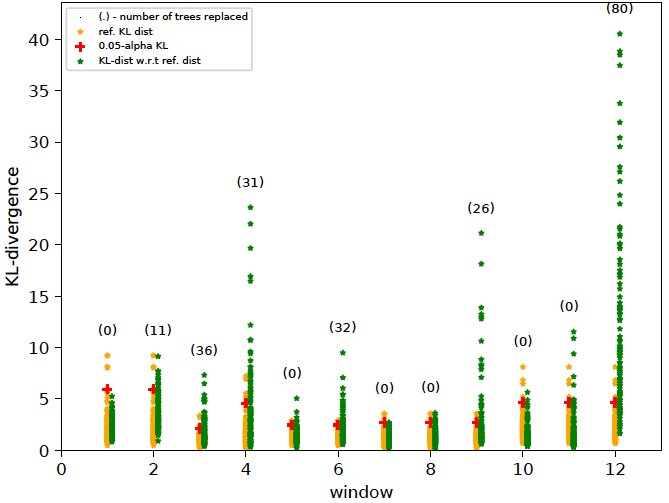

Python libraries required:
--------------------------
    numpy (1.14.2)
    scipy (1.0.0)
    scikit-learn (0.19.1)
    cvxopt (1.1.9)
    pandas (0.21.0)
    ranking (0.3.1)
    statsmodels (0.8.0)
    matplotlib (2.1.0)
    tensorflow (1.6.0)

Note: The code has been tested with **python 2.7**.

Anomaly Detection Examples
--------------------------
This is a collection of anomaly detection examples for detection methods popular in academic literature and in practice. I will include more examples as and when I find time.

Some techniques covered are listed below. These are a mere drop in the ocean of all anomaly detectors and are only meant to highlight some broad categories. Apologies if your favorite one is currently not included -- hopefully in time...
  - i.i.d setting:
    - [Standard unsupervised anomaly detectors](python/ad/ad_outlier.py) (Isolation Forest, LODA, One-class SVM, LOF)
    - [Clustering and density-based](python/ad/gmm_outlier.py)
    - [Density estimation based](python/ad/kde_outlier.py)
    - [PCA Reconstruction-based](python/ad/pca_reconstruct.py)
    - [Autoencoder Reconstruction-based](python/dnn/autoencoder.py)
    - [Classifier and pseudo-anomaly based](python/ad/pseudo_anom_outlier.py)
    - [Ensemble/Projection-based](python/loda/loda.py)
    - [A demonstration of outlier influence](python/ad/outlier_effect.py)
    - [Spectral-based](python/ad/spectral_outlier.py)
  - timeseries
    - Forecasting-based
      - [ARIMA](python/timeseries/timeseries_arima.py)
      - [Regression](python/timeseries/timeseries_regression.py) (SVM, Random Forest, Neural Network)
      - [Recurrent Neural Networks](python/timeseries/timeseries_rnn.py)
    - i.i.d
      - [Windows/Shingle based](python/timeseries/timeseries_shingles.py) (Isolation Forest, One-class SVM, LOF, Autoencoder)
  - human-in-the-loop (active learning)
    - [Active Anomaly Discovery](python/aad) -- see [section on AAD below](#active-anomaly-discovery-aad) for instructions on how to run.

There are multiple datasets (synthetic/real) supported. Change the code to work with whichever dataset or algorithm is desired. Most of the demos will output pdf plots under the 'python/temp' folder when executed.

**AUC** is the most common metric used to report anomaly detection performance. See [here](python/dnn/autoencoder.py) for a complete example with standard datasets.

The codebase also includes some [activity modeling stuff](#activity-modeling).

To execute the code:

1. **Run code from 'python' folder**. The outputs will be generated under 'temp' folder. The 'pythonw' command is used on OSX, but 'python' should be used on Linux.

2. To avoid import errors, make sure that PYTHONPATH is configured correctly to include the current dir:
.:/usr/local/lib/python

3. *The run commands are at the top of the python source code files.*

4. Check the log file in **'python/temp'** folder. Usually it will be named <demo_code>.log. Timeseries demos will output logs under the 'python/temp/timeseries' folder.

Active Anomaly Discovery (AAD)
------------------------------
This codebase replaces the older 'pyaad' project (https://github.com/shubhomoydas/pyaad). It implements an algorithm (AAD) to actively explore anomalies. The section ['Intuition behind Active Anomaly Discovery'](#intuition-behind-active-anomaly-discovery) explains the idea. **Assuming that the ensemble scores have already been computed**, the file (https://github.com/shubhomoydas/ad_examples/blob/master/python/percept/percept.py) implements AAD in a much more simplified manner.

To run (https://github.com/shubhomoydas/ad_examples/blob/master/python/percept/percept.py):

    pythonw -m percept.percept

The above command will generate a pdf file with plots illustrating how the data was actively labeled (https://github.com/shubhomoydas/ad_examples/blob/master/documentation/percept_taurel_fixedtau_prior.pdf).

**Reference(s)**:
  - Das, S., Wong, W-K., Dietterich, T., Fern, A. and Emmott, A. (2016). Incorporating Expert Feedback into Active Anomaly Discovery in the Proceedings of the IEEE International Conference on Data Mining. (http://web.engr.oregonstate.edu/~wongwe/papers/pdf/ICDM2016.AAD.pdf)
  (https://github.com/shubhomoydas/aad/blob/master/overview/ICDM2016-AAD.pptx)

  - Das, S., Wong, W-K., Fern, A., Dietterich, T. and Siddiqui, A. (2017). Incorporating Feedback into Tree-based Anomaly Detection, KDD Interactive Data Exploration and Analytics (IDEA) Workshop.
  (http://poloclub.gatech.edu/idea2017/papers/p25-das.pdf)
  (https://github.com/shubhomoydas/pyaad/blob/master/presentations/IDEA17_slides.pptx)

Running AAD
-----------
This codebase supports five different anomaly detection algorithms:
  - The LODA based AAD (**works with streaming data, but does not support incremental update to model after building the model with the first window of data**)
  - The Isolation Forest based AAD (**streaming support with model update**)
    - For streaming update, we support two modes:
      - **Mode 0**: Replace the oldest 20% trees (configurable) with new trees trained on the latest window of data. The previously learned weights of the nodes of the retained (80%) trees are retained, and the weights of nodes of new trees are set to a default value (see code) before normalizing the entire weight vector to unit length. For this mode, set *CHECK_KL_IND=0* in aad.sh.
      - **Mode 1** (Default): Replace trees based on KL-divergence. Further details are [below](#data-drift-detection). For this mode, set *CHECK_KL_IND=1* in aad.sh.
  - HS Trees based AAD (**streaming support with model update**)
    - For streaming update, the option '--tree_update_type=0' replaces the previous node-level sample counts with counts from the new window of data. This is as per the original published algorithm. The option '--tree_update_type=1' updates the node-level counts as a linear combination of previous and current counts -- this is an experimental feature.
  - RS Forest based AAD (**streaming support with model update**)
    - See the previous HS Trees streaming update options above.
  - The Isolation Forest based AAD with *Multiview* (**streaming support with model update**)
    - This is useful if (say) there are groups of features that represent coherent groups and we want to create trees only with the features in a particular group. For instance, in a malware detection application, we might have 100 features computed with static program features and 120 computed with dynamic program features. Then we want 50 isolation trees with only the 100 static features and 50 trees with the 120 dynamic features for a total of 100 trees. In a streaming situation, we would want the tree replacement to take into account the grouping as well, for example, if there has been no drift in the static features while there is a significant drift in dynamic features, we should not replace the trees of static features and only replace the trees of dynamic features.

To run the Isolation Forest / HS-Trees / RS-Forest / LODA based algorithms, the command has the following format (**remember to run the commands from the 'python' folder, and monitor progress in logs under 'python/temp' folder**):

    bash ./aad.sh <dataset> <budget> <reruns> <tau> <detector_type> <query_type> <query_confident[0|1]> <streaming[0|1]> <streaming_window> <retention_type[0|1]> <with_prior[0|1]> <init_type[0|1|2]>

    for Isolation Forest, set <detector_type>=7; 
    for HSTrees, set <detector_type>=11;
    for RSForest, set <detector_type>=12;
    for LODA, set <detector_type>=13;
    for Isolation Forest Multiview, set <detector_type>=15;

Example (with Isolation Forest, non-streaming):

    bash ./aad.sh toy2 35 1 0.03 7 1 0 0 512 0 1 1

Note: The above will generate 2D plots (tree partitions and score contours) under the 'temp' folder since <i>toy2</i> is a 2D dataset.

example (with HSTrees streaming):

    bash ./aad.sh toy2 35 1 0.03 11 1 0 1 256 0 1 1

**Note:** I **recommend using Isolation forest** instead of HSTrees and RSForest even if there is drift in data:

    bash ./aad.sh toy2 35 1 0.03 7 1 0 1 512 1 1 1

**Note on Streaming:**
Streaming currently supports two strategies for data retention:
  - Retention Type 0: Here the new instances from the stream completely overwrite the older *unlabeled instances* in memory.
  - Retention Type 1: Here the new instances are first merged with the older unlabeled instances and then the complete set is sorted in descending order on the distance from the margin. The top instances are retained; rest are discarded. **This is highly recommended.**

**Note on Query Diversity:**
See further [below](#query-diversity-with-compact-descriptions) for diversity based querying strategy. The '--query_type=8' option selects this. **To actually see benefits of this option, set batch size to greater than 1 (e.g., 3)**.

Generating compact descriptions with AAD
-------------------------------------------
ADD, when used with a forest-based detector such as Isolation Forest, can output a compact set of subspaces that contain all labeled anomalies. The idea is explained in https://github.com/shubhomoydas/ad_examples/blob/master/documentation/anomaly_description/anomaly_description.pdf. Following illustrations show the results of this approach.

To generate the below, use the command:
    
    bash ./aad.sh toy2 35 1 0.03 7 1 0 0 512 0 1 1

Query diversity with compact descriptions
-------------------------------------------
Again, the idea for querying a diverse set of instances without significantly affecting the anomaly detection efficiency is explained in https://github.com/shubhomoydas/ad_examples/blob/master/documentation/anomaly_description/anomaly_description.pdf.

To generate the below, use the command:
    
    bash ./aad.sh toy2 10 1 0.03 7 1 0 0 512 0 1 1

Does Query diversity with compact descriptions help?
-------------------------------------------
The below plots show that the above diversity strategy indeed helps.

To generate the below plots, perform the following steps (**remember to run the commands from the 'python' folder, and monitor progress in logs under 'python/temp' folder**):

    - set N_BATCH=1 in aad.sh and then run the command:
    
        bash ./aad.sh toy2 45 10 0.03 7 1 0 0 512 0 1 1
        
    - set N_BATCH=3 in aad.sh, and run the following commands:
    
        bash ./aad.sh toy2 45 10 0.03 7 1 0 0 512 0 1 1
        bash ./aad.sh toy2 45 10 0.03 7 2 0 0 512 0 1 1
        bash ./aad.sh toy2 45 10 0.03 7 8 0 0 512 0 1 1

    - Next, generate anomaly discovery curves:
        
        pythonw -m aad.plot_aad_results
        
    - Finally, generate class diversity plot:
    
        pythonw -m aad.plot_class_diversity

Differences between Isolation Forest, HS Trees, RS Forest
-------------------------------------------
This [document](https://github.com/shubhomoydas/ad_examples/blob/master/documentation/anomaly_description/anomaly_description.pdf) explains why Isolation Forest is more effective in incorporating feedback at the leaf level. This is illustrated in the figure below.

Running AAD with precomputed anomaly scores
-------------------------------------------
In case scores from anomaly detector ensembles are available in a CSV file, then AAD can be run with the following command.

    pythonw -m aad.precomputed_aad --startcol=2 --labelindex=1 --header --randseed=42 --dataset=toy --datafile=../datasets/toy.csv --scoresfile=../datasets/toy_scores.csv --querytype=1 --detector_type=14 --constrainttype=4 --sigma2=0.5 --budget=35 --tau=0.03 --Ca=1 --Cn=1 --Cx=1 --withprior --unifprior --init=1 --runtype=simple --log_file=./temp/precomputed_aad.log --debug

**Note: The detector_type is 14** for precomputed scores. The input file and scores should have the same format as in the example files (toy.csv, toy_scores.csv). Also, make sure the initialization is at uniform (**--init=1**) for good label efficiency (maximum reduction in false positives with minimum labeling effort). If the weights are initialized to zero or random, the results will be poor. *Ensembles enable us to get a good starting point for active learning in this case.*

Data Drift Detection
-------------------------------------------
This section applies to isolation tree-based detectors (such as [IForest](python/aad/random_split_trees.py) and [IForestMultiview](python/aad/multiview_forest.py)). Such trees provide a way to compute the KL-divergence between the data distribution of one [old] batch of data with another [new] batch. Once we determine which trees have the most significant KL-divergences w.r.t expected data distributions, we can replace them with new trees constructed from new data as follows:
  - First, randomly partition the current window of data into two equal parts (*A* and *B*).
  - For each tree in the forest, compute average KL-divergence as follows:
    - Treat the tree as set of histogram bins
    - Compute the instance distributions with each of the data partitions *A* and *B*.
    - Compute the KL-divergence between these two distributions.
    - Do this 10 times and average.
  - We now have *T* KL divergences where *T* is the number of trees.
  - Compute the (1-alpha) quantile value where alpha=0.05 by default, and call this *KL-q*.
  - Now compute the distributions for each isolation tree with the complete window of data -- call this *P* (*P* is a set of *T* distributions) -- and set it as the baseline.
  - When a new window of data arrives replace trees as follows:
    - Compute the distribution in each isolation tree with the *entire* window of new data and call this *Q* (*Q* is a set of *T* new distributions).
    - Next, check the KL-divergences between the distributions in P and the corresponding distributions in Q. If the KL-divergence i.e., *KL(p||q)* of at least (2\*alpha\*T) trees exceed *KL-q*, then:
      - Replace all trees whose *KL(p||q)* is higher than *KL-q* with new trees created with the new data.
      - Recompute *KL-q* and the baseline distributions *P* with the new data and the updated model.

For more details on KL-divergence based data drift detection, check the [demo code](python/aad/test_concept_drift.py). Execute this code with the following command and see the [plots](https://github.com/shubhomoydas/ad_examples/blob/master/documentation/concept_drift/concept_drift.pdf) generated:
    
    pythonw -m aad.test_concept_drift --debug --plot --log_file=temp/test_concept_drift.log --dataset=weather

Following is the data drift detection plot for the dataset **Weather**. The total number of trees *T* = **100**, and the streaming window size is 1024.

The idea is motivated by: Tamraparni Dasu, Shankar Krishnan, Suresh Venkatasubramanian and Ke Yi, *An information-theoretic approach to detecting changes in multi-dimensional data streams*, Symp. on the Interface of Statistics, Computing Science, and Applications, 2006 ([pdf](https://www.cse.ust.hk/~yike/datadiff/datadiff.pdf)).

Intuition behind Active Anomaly Discovery
-----------------------------------------

*Question: Why should active learning help in anomaly detection with ensembles?* Let us assume the anomaly scores are uniformly distributed on a 2D unit sphere as in the above figure (this is a setting commonly analysed in active learning theory literature as it is easier to convey the intuition). Also assume that *tau* fraction of instances are anomalous. When we treat the ensemble scores as 'features', then most anomaly 'feature' vectors will be closer to the uniform unit vector (uniform unit vector has the same values for all 'features') than nominals because anomaly detectors tend to assign higher scores to anomalies. This is another way of saying that the average of the anomaly scores across all ensemble members is a good representative of anomalousness (i.e., the dot product of the transformed 'features' with the uniform weight vector).

Seen another way, the hyperplane perpendicular to the uniform weight vector and offset by *cos(pi\*tau)* (in this simple 2D setting) should a good prior for the separating hyperplane between anomalies and nominals such that the *tau* fraction of anomalous instances lie at the extreme end -- the top right side of the hyperplane. The *ideal* classification rule then is: *sign(w.x - cos(pi.tau))* such that +1 is anomaly, -1 is nominal. On real-world data however, the true hyperplane is not exactly same as the uniform vector, but should be close (else the anomaly detectors forming the ensemble are poor). AAD is basically trying to find this true hyperplane by solving a large-margin classification problem. The example `percept.percept` illustrates this where we have true anomaly distribution (red points in the plots) at a slight angle from the uniform weights.

With active learning, the true anomaly region on the unit sphere (centered around blue line) can be discovered in a more efficient manner if we set the uniform vector as a prior. To understand this intuitively, observe that when the ensemble members are good, the anomalies lie close to the hyperplane as illustrated above. By design, as described in the previous paragraph, this hyperplane is displaced from the origin such that a small fraction (*tau*) of instances are on the extreme top-right side and the rest are on the other side. Now, note three important observations: (1) top ranked instances are close to the hyperplane, (2) since instances close to the hyperplane have the most uncertain labels, top-ranked instances lie in the region of uncertainty (from the margin perspective), and (3) ensembles are designed so that most anomalies are top-ranked in the score-space. Selecting top-ranked instances for labeling then results in uncertainty sampling which makes active learning *efficient* for learning the true hyperplane (refer to active learning theory). It also makes querying top-ranked instances efficient for discovering anomalies because: if the selected instance is truly an anomaly, it is a success; on the other hand, if it is a nominal, it still helps to efficiently adjust the margin so that future query instances are more likely to be anomalies.

**Note:** The hyperplane displacement *cos(pi\*tau)* is assumed only for the simple 2D scenario. In a real setting, we need to estimate the hyperplane displacement from the data, as is done by AAD.

**Caution:** By design, the uniform weight vector is more closely aligned with the ensemble score vectors of **true anomalies** than with the ensemble score vectors of true nominals. However, this alignment cannot be guaranteed when the score vectors are normalized to unit length (such that they all lie on a unit sphere). Still, if the number of ensemble members is very high -- such as with IForest where leaf nodes represent the members -- then the normalization is more likely to preserve the intended alignment. This is probably due to some properties of high-dimensional geometry. The distribution of the angles between the normalized score vectors and the uniform weight vector can be checked with aad.test_hyperplane_angles. The plotted histograms show that true anomalies are usually closer to uniform vector (measured in angles) when IForest is used, and the optimal hyperplane (computed with a perceptron) has an acute angle with uniform vector. As a recommendation: the IForest leaf-based scores may be normalied, but LODA based scores should *not* be normalied to unit length because the number of LODA projections is smaller.

**General anomaly score distribution:** Previously, we assumed that the anomaly scores are distributed on a sphere. This is not actually required for the intuition to work. Without loss of generality, assume that the anomaly scores from the ensemble members are normalized to lie between [0, 1]. This is the most common setup while combining ensemble scores. The figure below illustrates this scenario. We can see that the intuition discussed in this section applies to this setup as well.

Note on Spectral Clustering by label diffusion
----------------------------------------------
Spectral clustering tries to first find a lower dimensional representation of the data where it is better clustered after taking into account the inherent manifold structures. Next, any standard anomaly detector can be applied on the new representation. Although the python code has the [implementation](python/ad/spectral_outlier.py), the last step requires non-metric MDS transform and the scikit-learn implementation is not as good as R. Hence, use the R code (R/manifold_learn.R) for generating the transformed features.

For details, refer to:
Supervised and Semi-supervised Approaches Based on Locally-Weighted Logistic Regression by Shubhomoy Das, Travis Moore, Weng-keen Wong, Simone Stumpf, Ian Oberst, Kevin Mcintosh, Margaret Burnett, Artificial Intelligence, 2013.

Activity Modeling
-----------------
A simple application of word2vec for activity modeling can be found [here](python/timeseries/activity_word2vec.py). We try to infer relative sensor locations from sequence of sensor triggerings. The true [floor plan](http://ailab.wsu.edu/casas/hh/hh101/profile/page-6.html) and the inferred sensor locations (**for sensor ids starting with 'M' and 'MA'**) are shown below.

Please refer to the following paper and the [CASAS website](http://ailab.wsu.edu/casas/hh) for the setup:
    D. Cook, A. Crandall, B. Thomas, and N. Krishnan.
    CASAS: A smart home in a box. IEEE Computer, 46(7):62-69, 2013.

