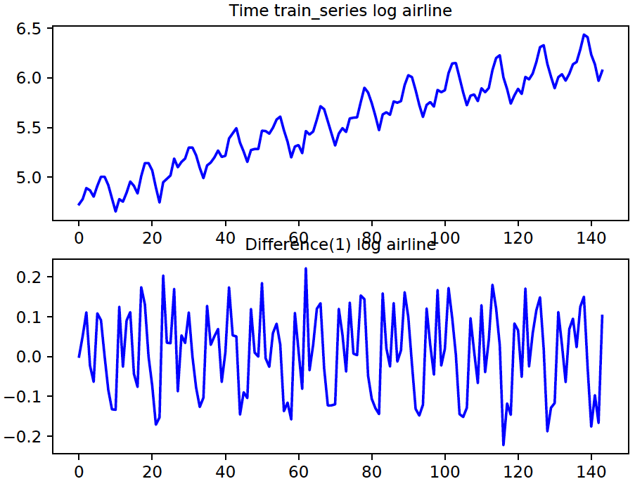

Timeseries Anomaly Detection
============================
The main motivation for writing these timeseries examples has been that while we can find each approach separately in other places on the web, we really should have most of them in one place to be able to compare head-to-head. **The parameter settings have been set to reasonable values, but should always be treated with a bit of skepticism since no formal model selection was employed**. The results look good with the *Airline* dataset as it was setup as the running example. However, they may be suboptimal with the other datasets (below) unless the parameters are tweaked a bit. The idea is to be able to play around with the basic timeseries modeling approaches and understand their strengths and weaknesses.

We will use the [Airline dataset](datasets/AirlinePassengers) as the running example here. The dataset can be selected with the command line option `--dataset=<name>`. Datasets included with the codebase are:
  - `airline`: [Airline dataset](datasets/AirlinePassengers)
  - `aus_beer`: [Australian beer production](datasets/AustralianBeerProduction)
  - `lynx`: [Canadian Lynx](datasets/CanadianLynx)
  - `fisher_temp`: [Fisher river temperature](datasets/FisherRiver)
  - `shampoo`: [Shampoo sales](datasets/ShampooSales)
  - `us_accident`: [US accident deaths](datasets/USAccidentalDeaths)
  - `wolf_sunspot`: [Wolf sunspot numbers](datasets/WolfSunSpot)

Timeseries forecasting generally involves the following steps (in order):
  - Exploratory analysis: Plot the timeseries and visually inspect it, employ ACF/PACF to determine lags (till how much in the past are values correlated) and seasonality.
  - Detrending: We remove the trend (i.e., monotonous increase/decrease in value) to make the series *stationary*. In most cases, subtracting each value with its previous will remove the trend.
  - Scaling: Scale values to a manageable range such as [-1, 1] so that algorithms can operate on well-conditioned values. We do this explicitly when applying our custom algorithms. Off-the-shelf forecasting algorithms such as ARIMA/SARIMA might not need this.
  - Model the normalized (detrended and scaled) time series: ARIMA/SARIMA, RNN/LSTM, Regression etc.
  - Forecast: Predict values into the future. This actually involves first predicting the normalized value and then applying inverse normalization. We will employ **rolling forecast** in the examples we present. Here, we predict only one timestep into the future. Then we get the true value and compute the **forecasting error**. Next, we append the true value to the training set and **remodel** the timeseries. This is repeated as long as desired.

**Reference(s)**:
  - Rob J Hyndman and George Athanasopoulos. *Forecasting: Principles and Practice*, 2nd Edition. OTexts, 2018. [online link](https://otexts.org/fpp2/)


Exploratory analysis
--------------------
The plots below are on the first page of the pdf generated by the command:

    pythonw -m timeseries.timeseries_arima --debug --plot --log_file=temp/timeseries/timeseries_arima.log --log_transform --dataset=airline

The original series is **log-transformed** (for variance stabilization) and is shown on the top row of the figure. There is a clear increasing trend. We de-trend the log-transformed series by differencing with 1-lag (bottom row of below figure).



The following plots are on the second page of the pdf generated by the same command (above). The PACF (bottom row in the below figure) shows that correlation decreases exponentially by 1-2 lags (or less); let's set the autocorrelation (AR) factor to 0. The ACF plot also shows peaks every 12 time points. This indicates a *seasonality* of 12. The ACF (top row in the below figure) drops to around zero by about lag 1. This indicates that a moving average (MA) factor of 1 might be reasonable in ARIMA models. It is usually hard to determine the best AR and MA factors, which is why AIC/BIC metrics are used for proper model selection. We will skip this for now.


ARIMA Forecasting
-----------------
Now that we have determined the parameters for the SARIMA model, we can use them to model the timeseries and forecast. We used the first two-thirds of the series as our training set and the last one-third as the test set. The red curve in the bottom row of the below figure shows the forecast values. The green lines indicate the 10 points at which the forecast error is the highest. The top row shows the residuals when we model the *entire* timeseries with the SARIMA model. *Whether we should treat the forecast errors as anomalies would depend on the application*. The ARIMA/SARIMA orders for the example datasets are defined in [timeseries_datasets.py](python/common/timeseries_datasets.py).

```python
univariate_timeseries_datasets = {
    # "name": (path, use_cols, date_columns, index_column, ARIMA_order)
    # ARIMA_order: (AR, differences, MA, seasonality)
    "airline": TsFileDef("AirlinePassengers/international-airline-passengers.csv", [1], False, None, (0, 1, 1, 12)),
    "aus_beer": TsFileDef("AustralianBeerProduction/quarterly-beer-production-in-aus.csv", [2], False, None, (3, 1, 0, 4)),
    "lynx": TsFileDef("CanadianLynx/lynx_trappings.csv", [1], False, None, (4, 1, 1, 12)),
    "fisher_temp": TsFileDef("FisherRiver/mean-daily-temperature-fisher-ri.csv", [1], False, None, (4, 1, 0)),
    "shampoo": TsFileDef("ShampooSales/sales-of-shampoo-over-a-three-ye.csv", [1], [0], None, (5, 1, 0)),
    "us_accident": TsFileDef("USAccidentalDeaths/accidental-deaths-in-usa-monthly.csv", [1], False, None, (4, 1, 0, 12)),
    "wolf_sunspot": TsFileDef("WolfSunSpot/wolfs-sunspot-numbers-1700-1988.csv", [1], False, None, (4, 1, 1, 12))
}
```


Regression Forecasting
----------------------
The idea here is to generate feature vectors which can be fed to a regression model. Specifically, if we have a timeseries *y_1, y_2, ..., y_N*, then we train a model for *y_(t+1) = f(y_(t-1), y_(t-2), .., y_(t-lag+1))*, i.e., a model that predicts the value at a particular time as a function of the previous values (till a reasonable lag). The plots below were generated with the commands:

    pythonw -m timeseries.timeseries_regression --n_epochs=200 --debug --log_file=temp/timeseries/timeseries_regression.log --normalize_trend --algo=nnsk --n_lags=12 --dataset=airline
    
    pythonw -m timeseries.timeseries_regression --n_epochs=200 --debug --log_file=temp/timeseries/timeseries_regression.log --normalize_trend --algo=rfor --n_lags=12 --dataset=airline

We show regression results with two algorithms: *Random Forest* and *Neural Network*. The section with the red curve is the forecast (test) data. Timepoints with the highest 10 errors are indicated with the green bars.


Timeseries modeling with RNNs/LSTMs
-----------------------------------
The timeseries can be modeled as sequential data with RNNs (basic cell or LSTM). The following command employs an RNN with the **basic cell**. The top row shows the original series. The blue section will be used for training, and the red section will be test. The middle section shows the scaled/normalized train and test sections. The bottom row shows that forecast after inverse normalization and the points with the highest 10 errors are indicated with the green bars.

    pythonw -m timeseries.timeseries_rnn --n_epochs=200 --debug --log_file=temp/timeseries/timeseries_rnn.log --normalize_trend --algo=basic --n_lags=12 --dataset=airline


A similar plot using an RNN with LSTM cells can be generated with the following command.
    
    pythonw -m timeseries.timeseries_rnn --n_epochs=200 --debug --log_file=temp/timeseries/timeseries_rnn.log --normalize_trend --algo=lstm --n_lags=12 --dataset=airline

The generated plots are shown below. In general, ARIMA and regression methods are probably better suited to the *Airline* dataset than the RNN models.


Timeseries outliers with shingles
---------------------------------
Here we illustrate the idea of anomaly detection in time series by breaking the series into windows ('shingles'), and then treating each window as i.i.d feature vector. Since we have been using the *Airline* dataset we will show the results on it here as well. However, keep in mind that this approach might **not** be the best for this dataset. Also, we do not require separate train/test sets; all the windows can be input to an unsupervised anomaly/outlier detector as a single dataset. For *Airline*, we set the window size to 6 and employ an Isolation Forest anomaly detectore. Since there is a clear trend, it is important to remove the trend before breaking up the timeseries into the smaller windows. The below command will output the plots below. `--log_transform` applies element-wise log to the series. This sometimes helps in stabilizing the variance. Other transforms should also be tried such as [Box-Cox transforms](https://en.wikipedia.org/wiki/Power_transform). Multiplicative seasonal and trend decomposition (`statsmodels.tsa.seasonal.seasonal_decompose`) might help as well, but we have not pursued this here. The red lines in the plots show the top 10 most anomalous windows. Note that unlike the previous examples where we reported the anomalous time **points**, here we can only report the anomalous time **windows**.

    pythonw -m timeseries.timeseries_shingles --debug --plot --log_file=temp/timeseries/timeseries_shingles.log --n_lags=6 --algo=ifor --normalize_trend --log_transform --dataset=airline


A more appropriate example might be the [simulated timeseries](datasets/simulated_timeseries). The below command breaks the timeseries into non-overlapping windows of 20 timepoints and then applies an autoencoder as the anomaly detector. The red lines show the top 10 most anomalous windows.

    pythonw -m timeseries.timeseries_shingles --debug --plot --log_file=temp/timeseries/timeseries_shingles.log --n_lags=20 --algo=autoenc --dataset=synthetic


